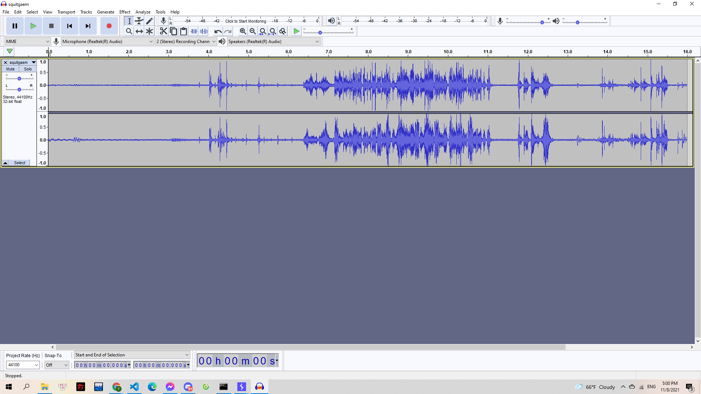
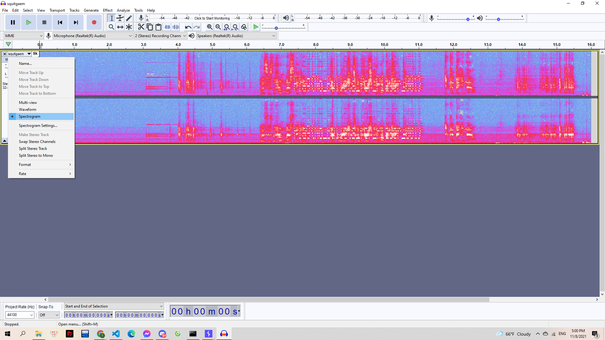
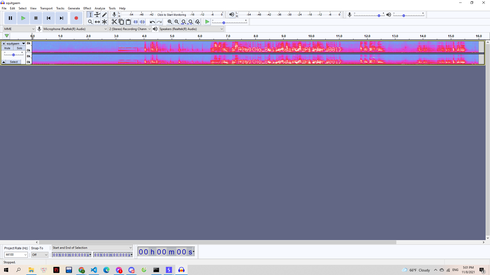

# AudiCaty

Hazy gửi cho Gà một thông điệp bí mật, kèm một lời nhắn "Đừng vội vàng kết luận môt vấn đề, luôn phải để mắt thấy tai nghe"

> [squitgaem.wav](squitgaem.wav)

---

Một file audio nghe khá chói tai. Mình sử dụng tool `Audicaty` đúng như đề bài để xem thử file này. Mình thu được dạng `waveform`:

> 

Chuyển sang dạng Spectrogram:

> 

Mình thấy ở giữa có cách vệt trắng. Mình thử thay đổi kích thước hai thanh này và nhận thấy được form của flag:

> 

Căng mắt ra đọc và mình có được flag:
**Flag{No_Bullets_for_Player_001}**
