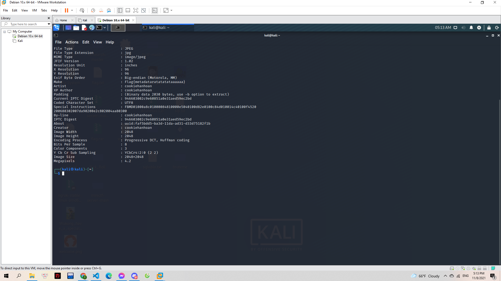

# Basic Image

Đố bạn biết bức ảnh này được nhắc tới bài viết nào trên Fanpage của Cookie Hân Hoan ấy. Hehe!

https://www.facebook.com/cookie.han.hoan/

> 

---

Ở bài này mình sử sụng `exiftool` bên kali để làm (Một cách đơn giản hơn là bạn có thể đổi đuôi file thành txt rồi mở xem):

> 

**Flag{metadataratatatataaaaaa}**
