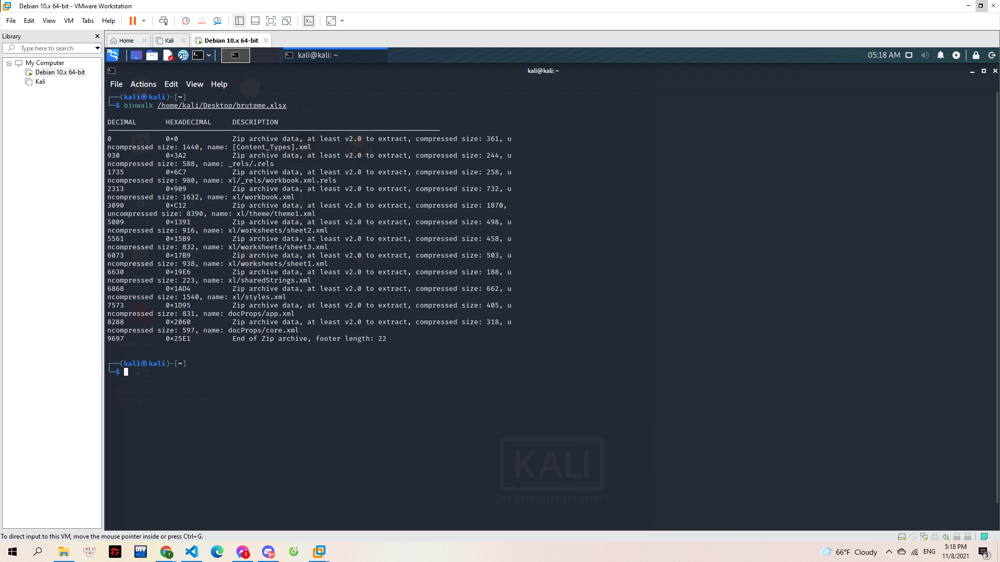
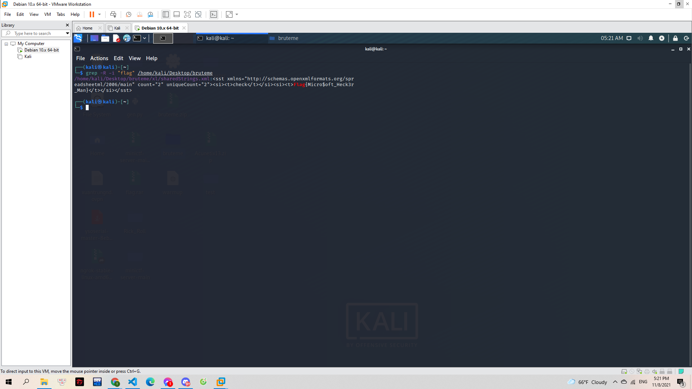

# ExSeller

Để không bị Mèo nhòm ngó tệp tài liệu quan trọng. Gà nhanh tay đặt mật khẩu, nhưng lại vô tình quên mất. Làm thế nào bây giờ T_T

> [bruteme.xlsx](bruteme.xlsx)

---

Mình nhận được 1 file excel. Nhưng khi mở lên thì không thấy có thông tin gì đặc biệt. Mình chuyển qua kali để phân tích file này. Trước hết là dùng `binwalk` để xem có file nào ẩn trong đây không

> 

Mình thấy có khá nhiều file zip. Nên mình đã giải nén, và thu được 1 folder có khá nhiều file. Mình đoán flag được giấu trong đây nên đã dùng `grep` để tìm thử. Và thế là mình có được flag:

> 

**Flag{Micro$oft_Heck3r_Man}**
