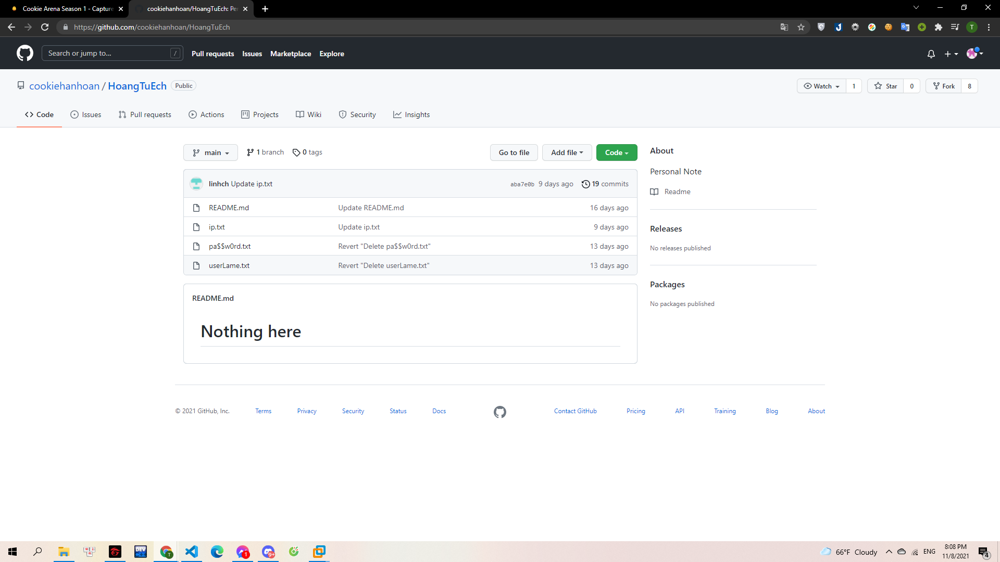
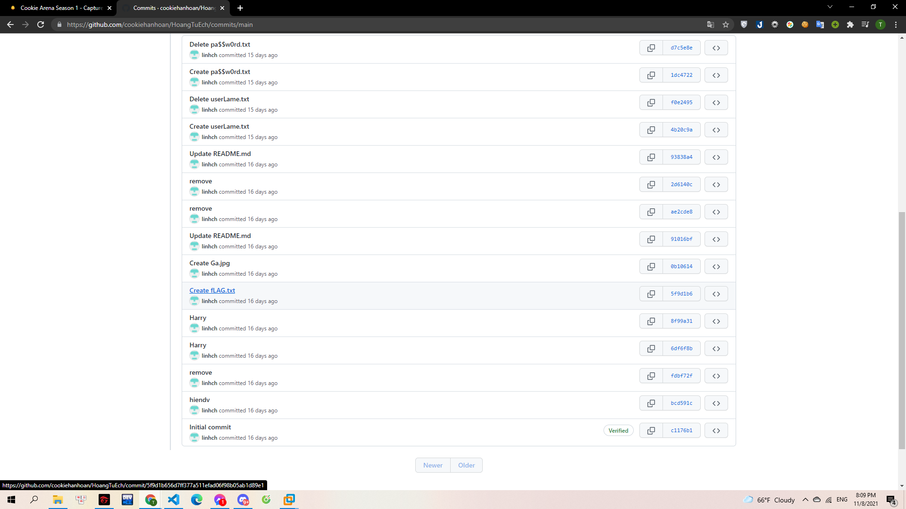
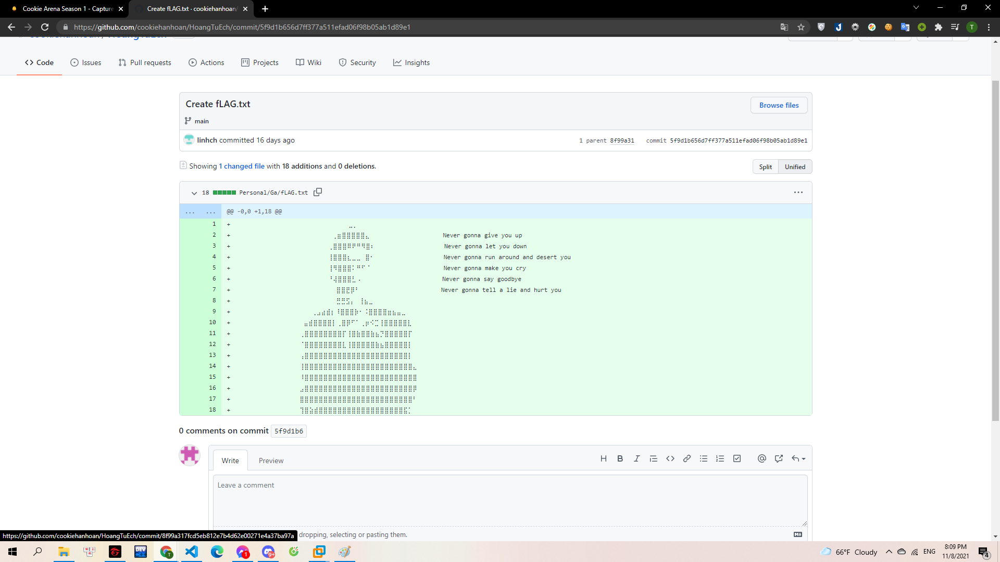
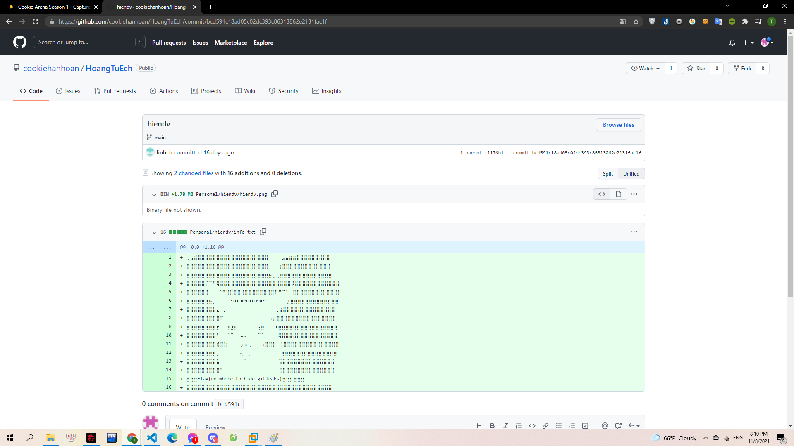

#Github

Được biết tới như một kho lưu trữ mã nguồn khổng lồ của thế giới, và những thay đổi trong quá khứ đều được lưu lại và khôi phục. Hãy kiếm tìm những bí mật mà Gà con lon ton vô tình để lại.

> https://github.com/.....

---

Mình vào github tìm cookiehanhoan thì đã có thể thấy account của cookiehanhoan.

> 

Mình thấy có khá nhiều commit nên tò mò vào xem. Và mình thấy có lịch sử tạo file fLAG.txt:

> 

Sau khi vào thì mình thấy file này còn có `1 parent 8f99a31` nên mình mò dần theo đó:

> 

Mình cứ thế chuyển tới các parent và đã tìm được flag:

> 

**Flag{no_where_to_hide_gitleaks}**
