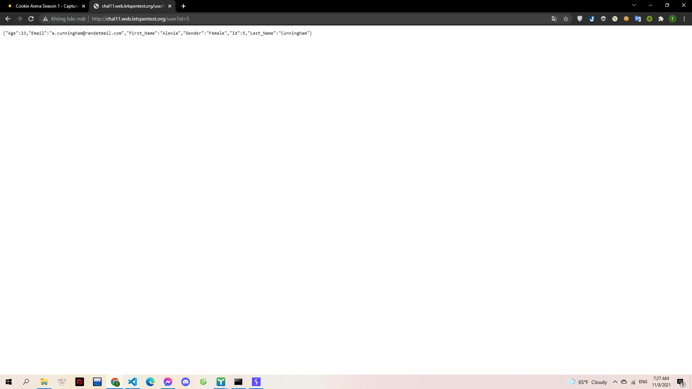
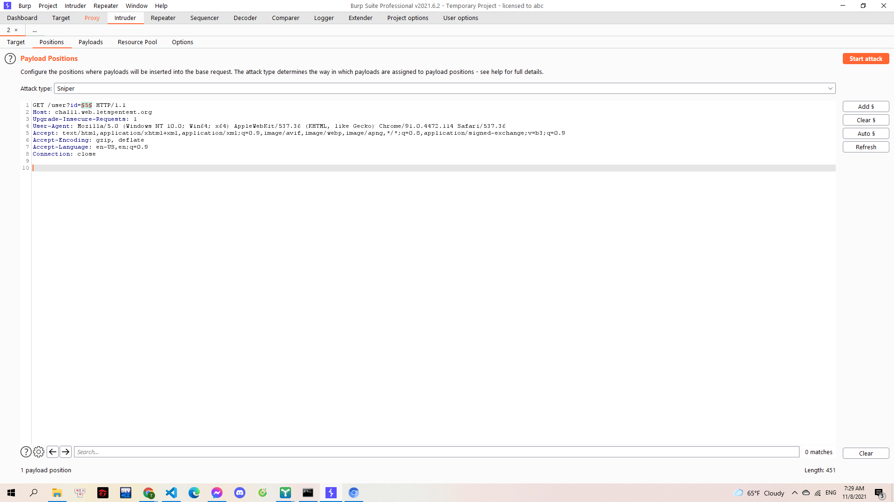
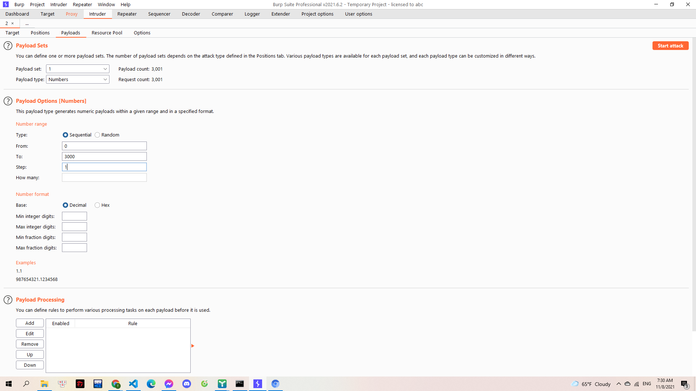
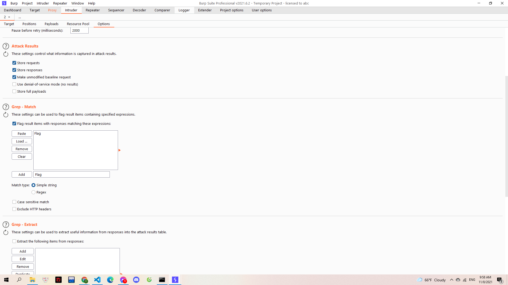
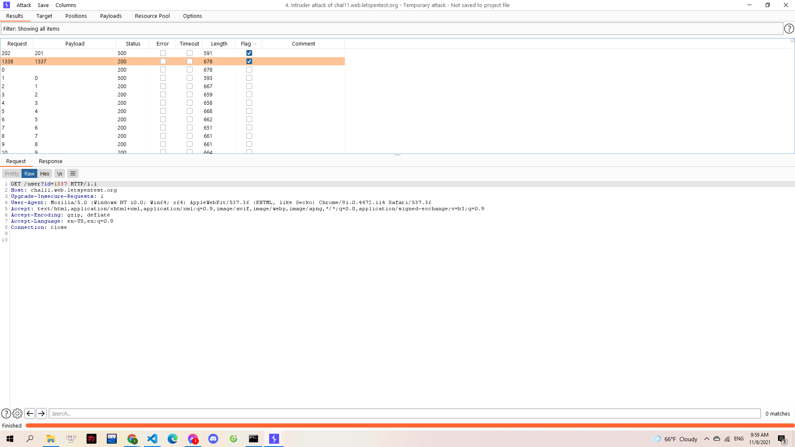

# ID'OR1=1

Một lỗ hổng rất cơ bản! Nhưng nếu nó xảy ra thì hậu quả rất khủng khiếp...

> http://chal11.web.letspentest.org/

---

Mình thử vào web và nhập 1 id bất kì

> 

Mình thấy id xuất hiện trên URL hơn nữa có thể thay đổi để lấy các thông tin khác nhau -> Lỗ hổng IDOR.Mình đoán rằng ở một id nào đó sẽ có flag. Mình sử dụng BurpSuite để brute và xem các response trả về.

> 

> 

Mình add thêm một grep-match string để tìm:

> 

Brute và thu được kết quả:

> 

**Flag{61cb4a784e83b6109999af6f036b88bf}**
