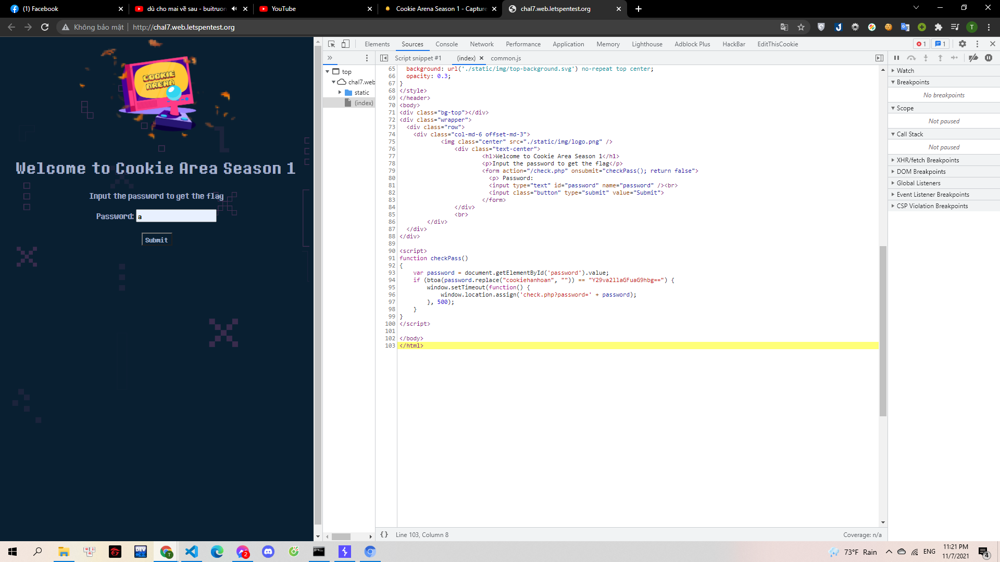

# Impossible

Học lỏm được công thức chế tạo lá chắn tàng hình của Hazy. Gà nhanh chóng đem về xây dựng hệ thống phòng thủ của riêng mình. Liệu nó có làm khó được Mèo Yang Hồ không?

> http://chal7.web.letspentest.org/

---

Mình vào web nhập một Password bất kì và không submit được. Nên tiến hành xem source code và tìm ra được hàm xử lý password:

> 

Hàm này sẽ loại bỏ chuỗi "cookiehanhoan" trong password sau đó mã hóa base64. Mình thấy chuỗi base64 lại chính là "cookiehanhoan". Tức là nếu loại bỏ "cookiehanhoan" mà vẫn thu về được "cookiehanhoan" thì sẽ ra flag

Mình thử với chuỗi dạng "cookiehanhoancookiehanhoan" nhưng đã không được.

Nhưng khi mình thay nó bằng chuỗi dạng "ccookiehanhoanookiehanhoan". Tức là chèn "cookiehanhoan" vào giữa các kí tự của chuỗi "cookiehanhoan" thì lại thành công. Hơi khó hiểu nhưng đây là cơ chế của JS.

**Flag{Javascript_is_not_safe???}**
