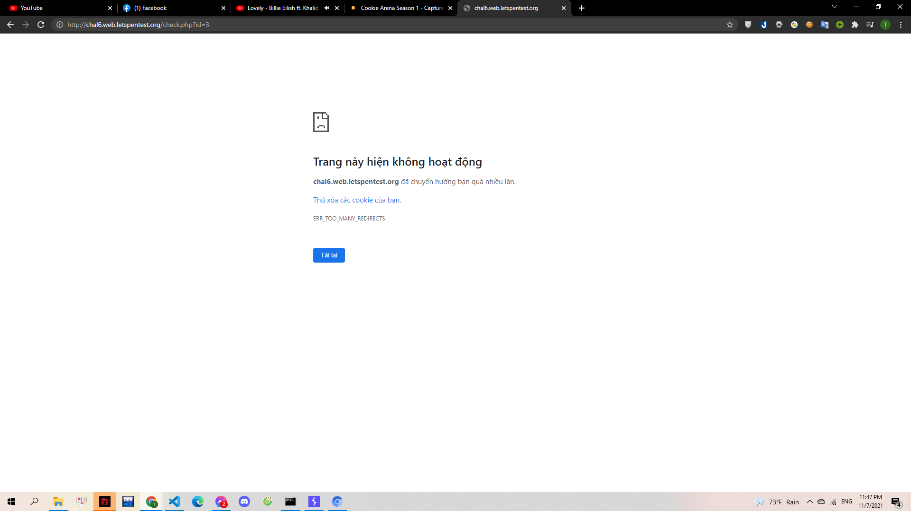
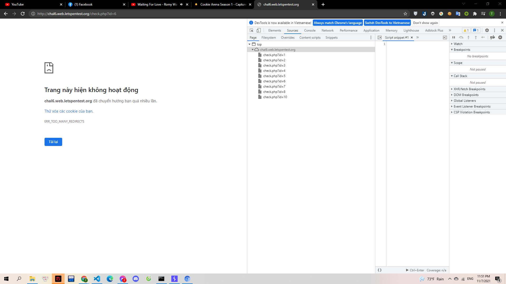
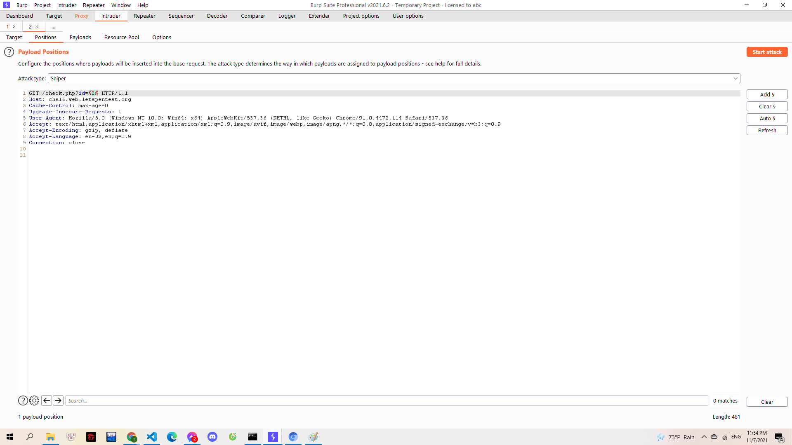
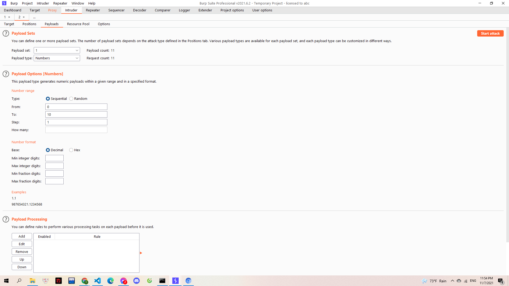
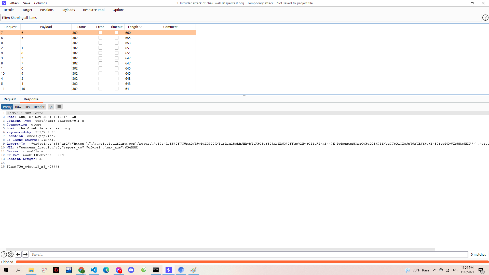

# Infinite Loop

Cuộc đời luôn là vậy. Một giây trước tưởng đã cùng đường, một giây sau có lại đầy hy vọng. Các chiến binh đã có công cụ mạnh mẽ trong tay, hãy dùng nó để can thiệp dòng chảy.

> http://chal6.web.letspentest.org/

---

Mình vào web đăng nhập bằng 1 tài khoản bất kì thì hiện thông báo trang không hoạt động:

> 

Tuy nhiên khi để ý kĩ thì mình phát hiện ra một điều. So với lúc đầu thì id trên URL đã thay đổi. Và thế là mình kiếm tra source code:

> 

Mình tìm thấy các id chạy từ 0 đến 10. Mình thử đem vào BurpSuite để brute id và tìm kết quả:

> 

Mình cho id chạy từ 0 đến 10:

> 

Lọc response theo lenght giảm dần:

> 

**Flag{Y0u_c4ptur3_m3_xD!!!}**
