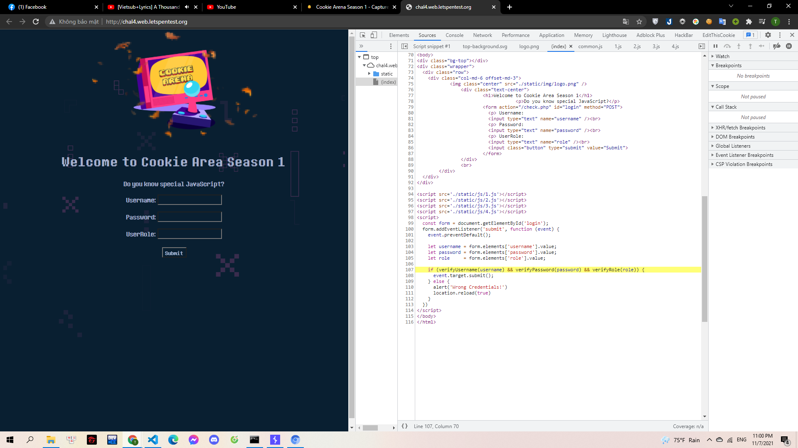
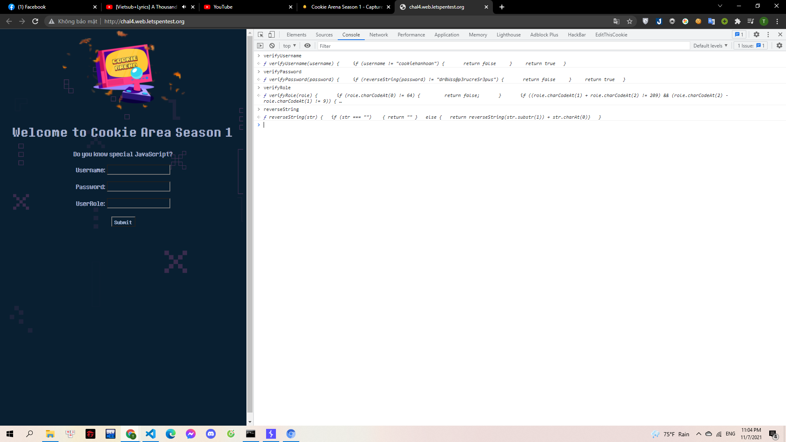
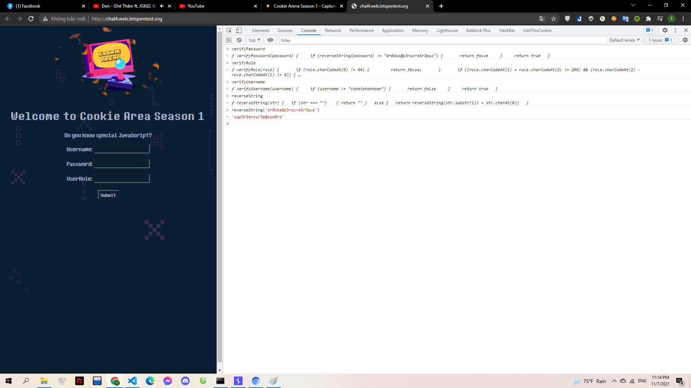

# JS Beep Beep

Sau nhiều đêm suy nghĩ về việc làm thế nào để bảo vệ mã nguồn. Cố gắng thoát khỏi ánh mắt soi mói của Mèo Yang Hồ.

Gà chẹp miệng rồi nói: "Đã tới lúc phải cho nó phải thốt lên rằng! WTF!!!"

> http://chal4.web.letspentest.org/

---

Mình vào web nhập một vài thông tin bất kì thì bị sai thông tin, sau đó mình kiểm tra source code thì thấy có 1 số hàm dùng cho việc xác thực:

> 

Mình sử dụng console để tìm 4 hàm này:

> 

Đọc các hàm thì dễ dàng tìm được:

- User: cookiehanhoan
- Role: @dmiN
- Password: sup3rSercur3p@ssW0rd
  - Khi tìm password mình thấy có hàm reverseString.Mình gọi thử hàm này và truyền vào giá trị đề cho.

> 

Với 3 thông tin này là mình đã tìm ra được flag:
**Flag{JAV-ascript_F\*ck}**
