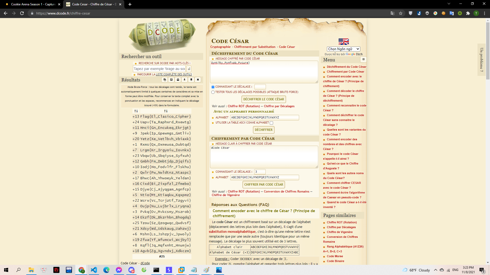

# Julius Caesar

Vô tình khi khai quật khảo cổ, Gà tìm được một thông điệp bí ẩn khoảng hơn 100 năm trước công nguyên. Nghe đồn đây là một bí thuật đã bị thay đổi công thức của một vị tướng Julius Caesar, sau này trở thành vị vua đầu tiên của đế chế La Mã hùng mạnh.

Hãy giúp Gà giải mật thư này!

> [cipher.txt](cipher.txt)

---

Theo như đề bài thì mình biết được đây là mật mã Caesar. Mình tiếp tục sử dụng trang dcode.fr. Tìm và brute Caesar, mình thu được flag:

> 

**Flag{El_Clasico_Cipher}**
