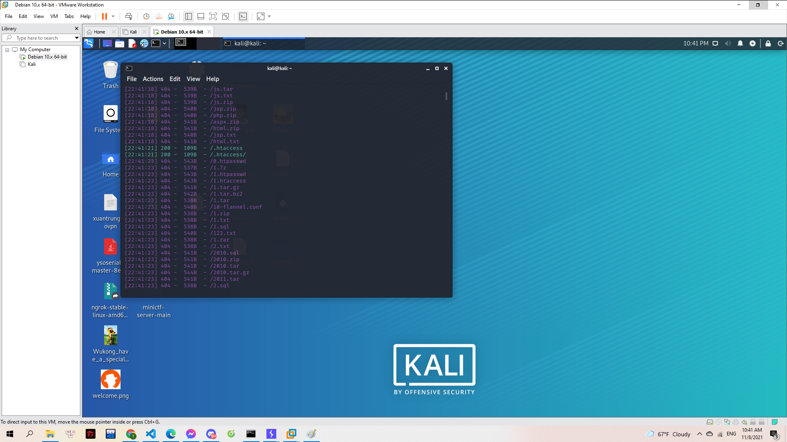
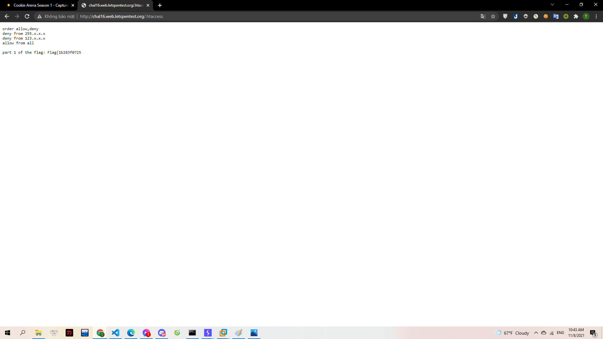
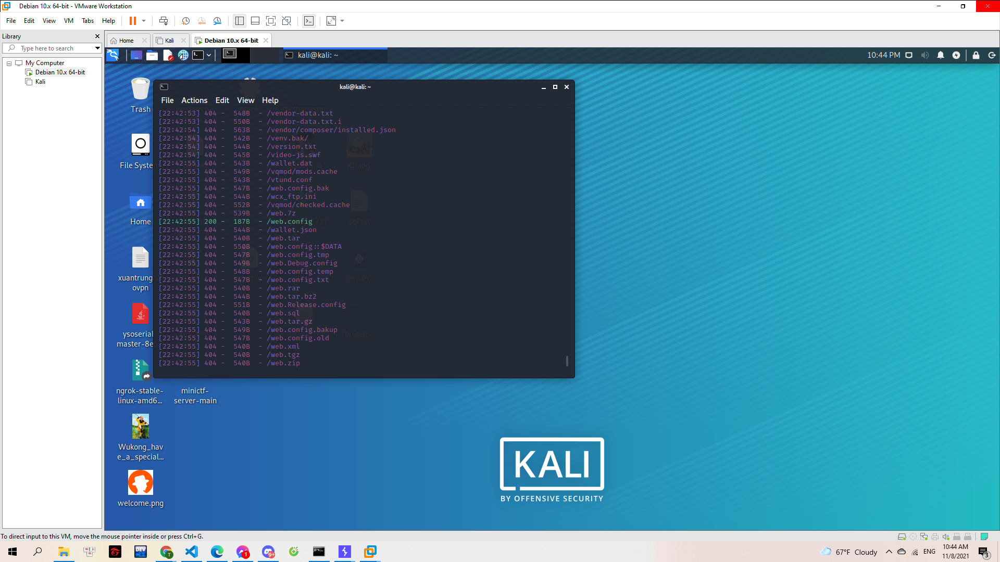
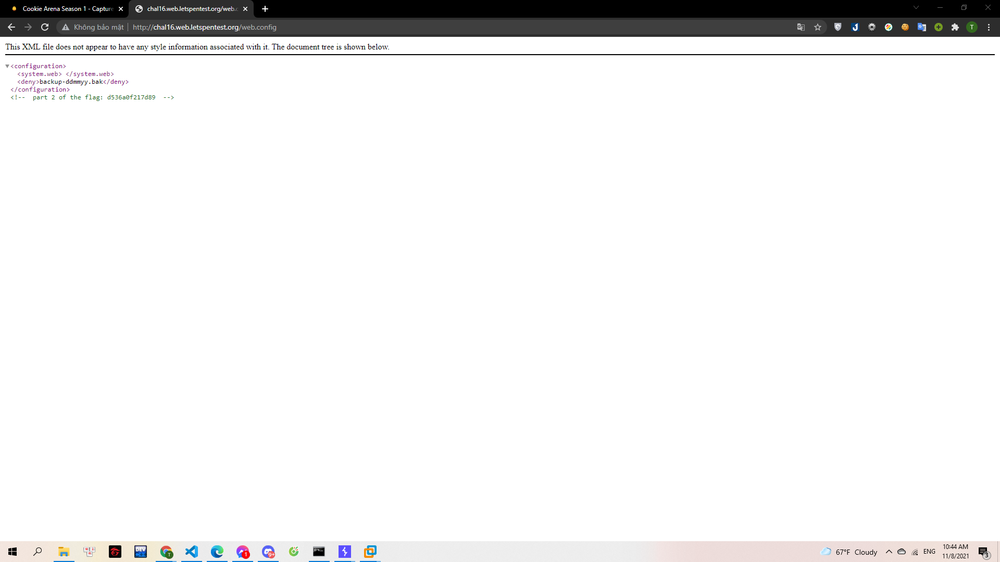

# Misconfiguration

Chẳng biết vô tình hay cố ý, Gà mắc phải một sai lầm không đáng có trong việc thiết lập cấu hình Web Server.

Từ một lỗ hổng nhỏ tí xíu, Mèo Yang Hồ sẽ tận dụng mọi trí tưởng tượng và kĩ thuật để thâm nhập được sâu hơn.

> http://chal16.web.letspentest.org/

---

Sau khi vào web và xem source code không phát hiện gì đặc biệt nên mình đã nghĩ đến việc tìm file ẩn qua URL. Mình sử dụng **dirsearch** trên linux để tìm kiếm:

File ẩn đầu tiên tìm được qua URL **/.htaccess**

> 

Kết quả:

> 

File ẩn thứ hai **/web.config**

> 

Kết quả:

> 

Trong source code trên có phần gợi ý đến 1 file backup **backup-ddmmyy.bak**. Mình thay vào URL thì trình duyệt sẽ down về 1 file .bak. Mình xác định được đây là file nén .rar.

> [backup-ddmmyy.rar](backup-ddmmyy.rar)

Giải nén và tìm được mảnh ghép cuối của Flag.

**Flag{1b283f0725d536a0f217d89caca7b183}**
