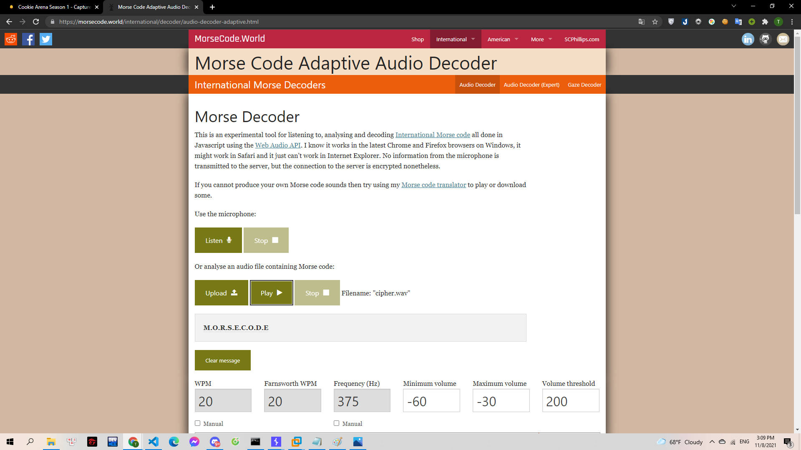

# Morse

Suỵt! Tập trung và đeo tai nghe lên nào. Gà có nghe thấy nhịp beat không? Họ nói gì từ bên kia chiến tuyến Format: Flag{what_you_find}

> [cipher.wav](cipher.wav)

---

Mở đoạn audio lên nghe thì mình nhận ra đó là mã morse nên đã tìm tool trên google để giải. Mình tìm được trang `https://morsecode.world/international/decoder/audio-decoder-adaptive.html`.

Việc của mình chỉ là upload file và format lại flag:

> 

**Flag{M.O.R.S.E.C.O.D.E}**
