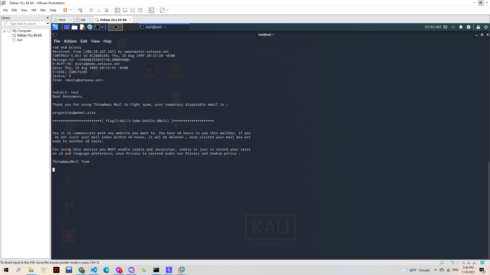

# Post Office Man

Anh bưu tá này là một người mà Gà rất tin tưởng. Gà ủy quyền cho anh ấy lên bưu điện, nói chuyện với anh kiểm thư để lấy thư về.

Nếu giấy ủy quyền hợp lệ, anh kiểm thư sẽ giữ lại bản gốc rồi photocopy ra một bản khác để anh bưu tá đem về cho Gà. Để nhỡ trong trường hợp Gà có tức quá xé thư đi thì vẫn có thể lên đây lấy lại.

Đố bạn anh bưu tá sử dụng giao thức email nào để nói chuyện với anh kiểm thư?

> network.letspentest.org 9002

---

Mình dùng netcat để kết nối tới cổng:

> nc network.letspentest.org 9002

Sau khi nhập thông tin với cú pháp USER rồi PASS theo yêu cầu thì mình có nhập bừa 1 vài kí tự

> 

Biết được cần sử dụng lệnh POP3 nên mình đã đi tra các câu lệnh: https://electrictoolbox.com/pop3-commands/

Mình dùng lệnh LIST xem các tệp:

> 

Sau đó thì mở từng tệp bằng lệnh RETR. Mở đến tệp số 8 thì xuất hiện flag:

> 

**Flag{1-Ha\/3-1o0o-UnS33n-3Ma1L}**
