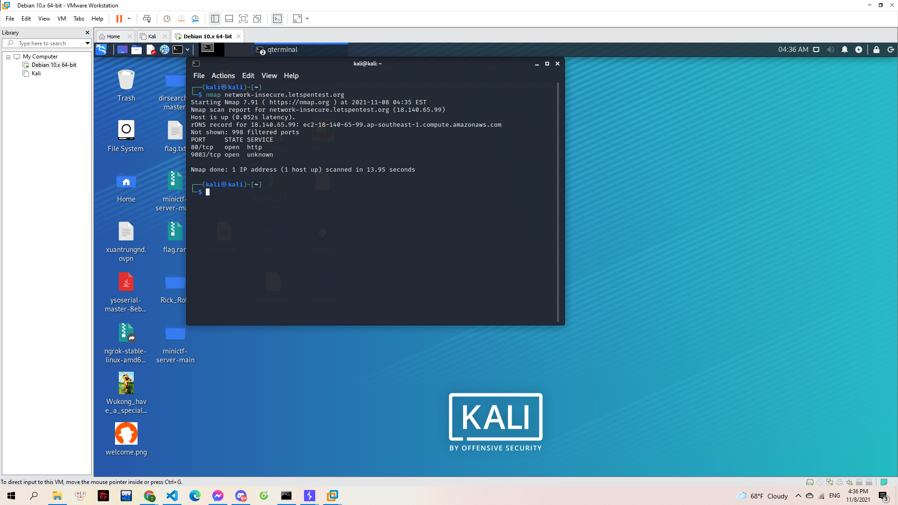
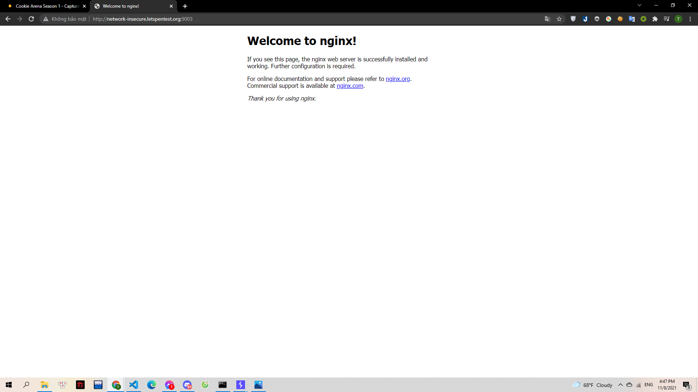
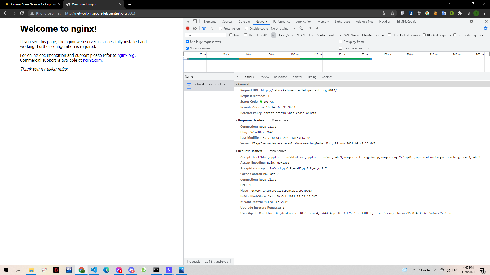

# Scan me if you can

Nếu coi mỗi máy chủ là một ngôi nhà, trước khi xâm nhập vào bên trong, các Hacker phải thực hiện việc thăm dò. Họ xem xét đâu là điểm yếu nhất của ngôi nhà, chỗ nào là điểm mù camera? Chủ nhà hoặc bảo vệ sẽ phản ứng thế nào khi có xuất hiện các dấu hiệu bất thường?

Trong quá trình tìm kiếm lỗ hổng, Hazy thường xem xét ngôi nhà này có bao nhiêu cánh cửa đang mở (Port). Hãy sử dụng công cụ thân quen để "ném đá" vào tất cả các cánh cửa của ngôi nhà.

Biết rằng, cửa sổ được đánh số từ 8100 tới 9100

Dựa vào sự phản hồi bạn sẽ biết được những điều thú vị!

> network-insecure.letspentest.org

---

Mình sử dụng nmap để có thể scan port:

`nmap network-insecure.letspentest.org`

> 

Theo như đề thì mình xác định được port cần tìm có thể là 9003. Mình thử kết nối bằng `nc` nhưng kali của mình bị treo khá lâu. Nên mình sử dụng trình duyệt xem thử:

> 

Sau đó mình đã check source nhưng cũng không tìm được gì. Tuy nhiên khi kiểm tra network và reload. Mình tìm được flag ở response trả về:

> 

**Flag{Every-Header-Have-It-Own-Meaning}**
