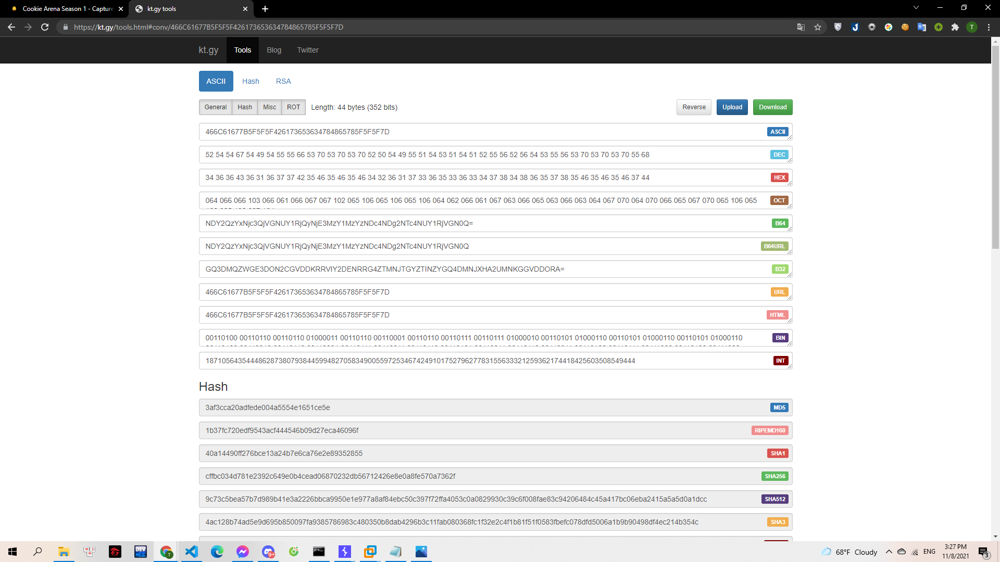
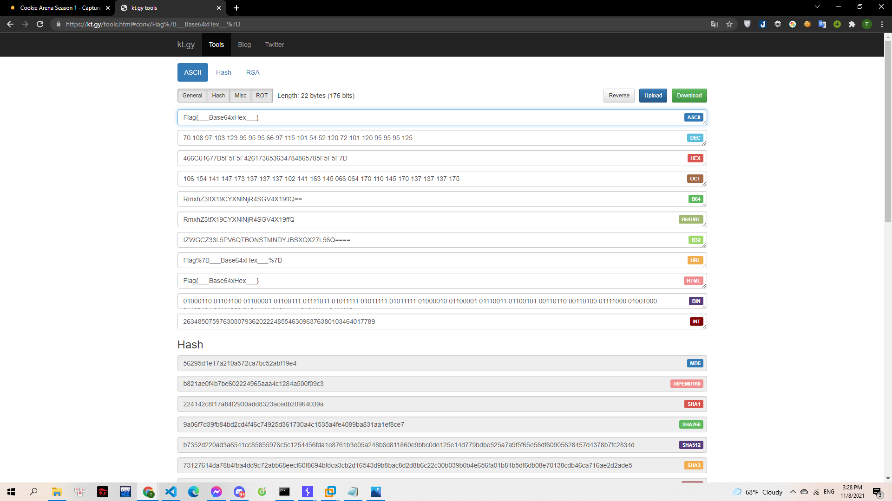

# Sixty Four

Gà để lại một thông điệp bí mật nhưng nó không làm khó được trí thông minh của Mèo Yang Hồ.

> [cipher.txt](cipher.txt)

---

Đọc đề bài cũng như dạng của đoạn cipher thì mình đã đoán đó là base64. Mình sử dụng kt.gy để decode:

> 

Ra được đoạn mã gồm các số và các chữ cái B,D,E,F nên mình đã đoán đó là mã hex. Tiếp tục decode thử, và có được flag:

> 

**Flag{\_\_Base64xHex\_\_}**
