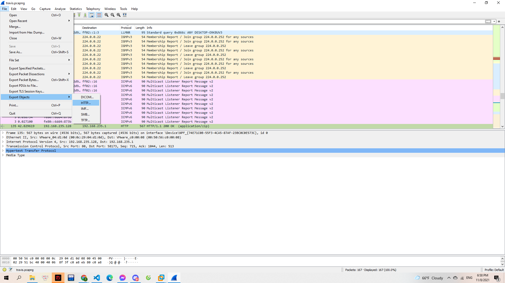
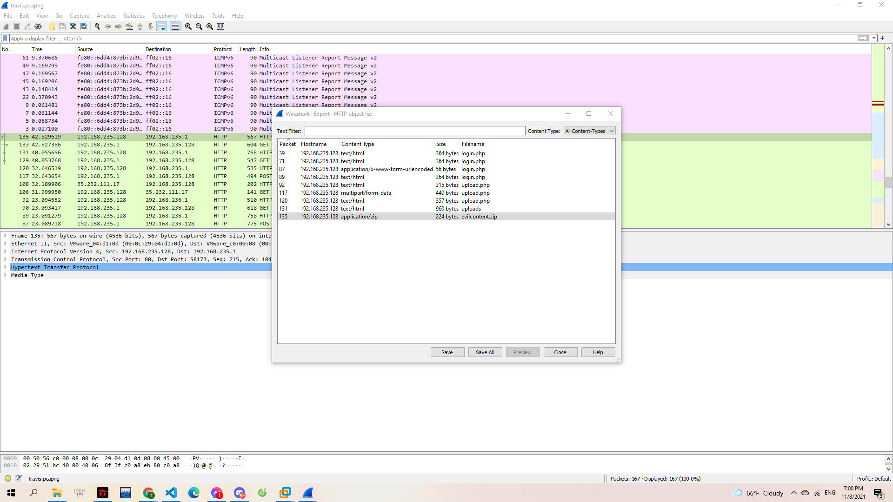
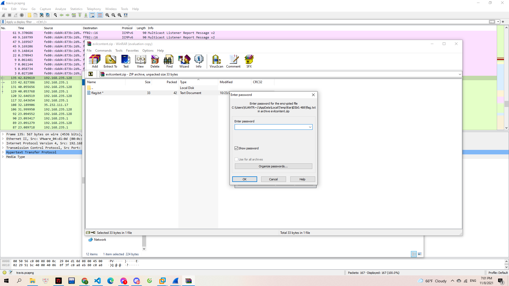

#Streamer

Anh nghệ sĩ nhiều đam mê đang vớt rác bên tàu. Ta lang thang với bản vẽ đời ta tự tô màu.

Ô! Vớt được cái gì thú zị này!

> [travis.pcapng](travis.pcapng)

---

Một gói tin bắt được bằng `wireshark`. Mình mở lên rồi thử export các file trong gói tin này.

> 

Mình export tất cả các gói tin.

> 

Trong số những gói tin mình export ra thì có 1 file zip. Mình thử mở thì lại cần có password:

> 

Check trong các file còn lại thì mình thấy có 1 file có nội dung:

> username=travisscott&password=truongvinhcuc&submit=Login

Mình sử dụng password `truongvinhcuc` để giải nén và tìm ra được flag.

**Flag{TCP_streamin_go_skrrrrrrrt}**
