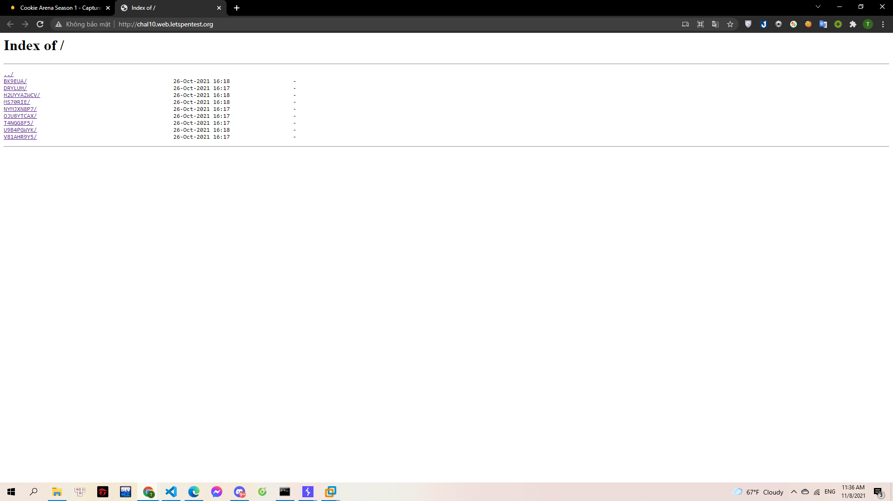
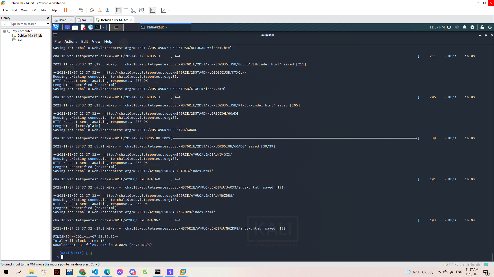
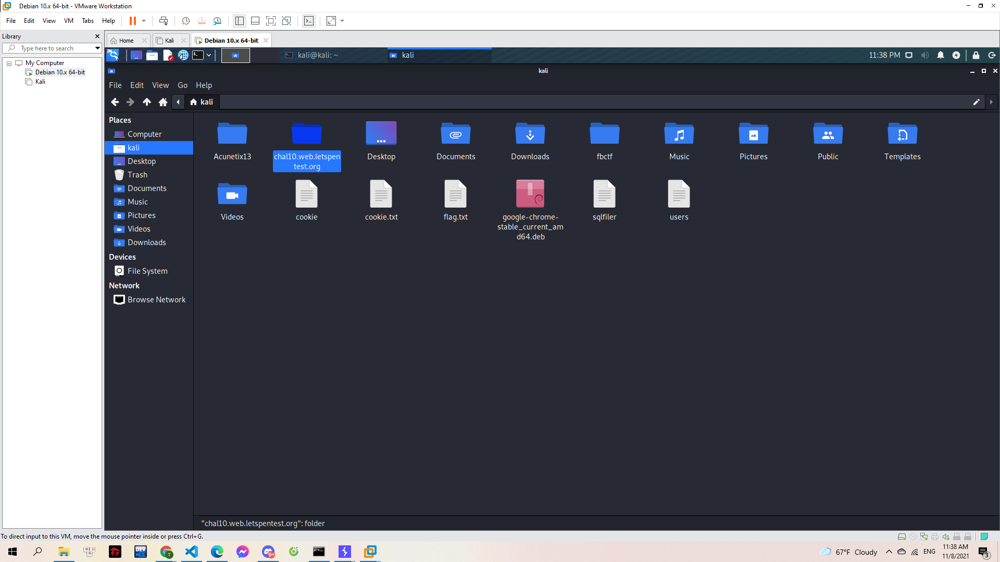
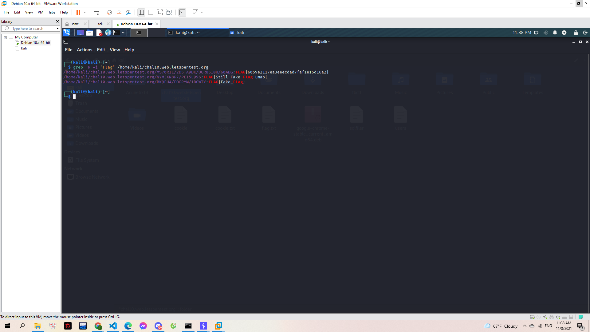

# The maze runner

Lạc vào một mê cung với vô vàn những chuỗi kí tự bí ẩn. Vừa chạy vừa phải nghĩ đâu mới manh mối giúp Gà thoát ra.

Hãy giúp Gà một tay nhé?

> http://chal10.web.letspentest.org/

---

Vào web thì mình thấy được khá nhiều folder:

> 

Challenge này hoàn toàn có thể tìm tay. Nhưng mình sử dụng linux để làm:

Trước tiên mình sẽ down toàn bộ source code về bằng câu lệnh:

```console
 wget -r http://chal10.web.letspentest.org/
```

> 

Source code tải về được lưu trong thư mục có tên là URL mình down:

> 

Bây giờ mình đi tìm kiếm flag ở trong đây bằng lệnh grep:

```console
grep -R -i "Flag" /home/kali/chal10.web.letspentest.org
```

Và thu được kết quả:

> 

**FLAG{6059e2117ea3eeecdad7faf1e15d16a2}**
