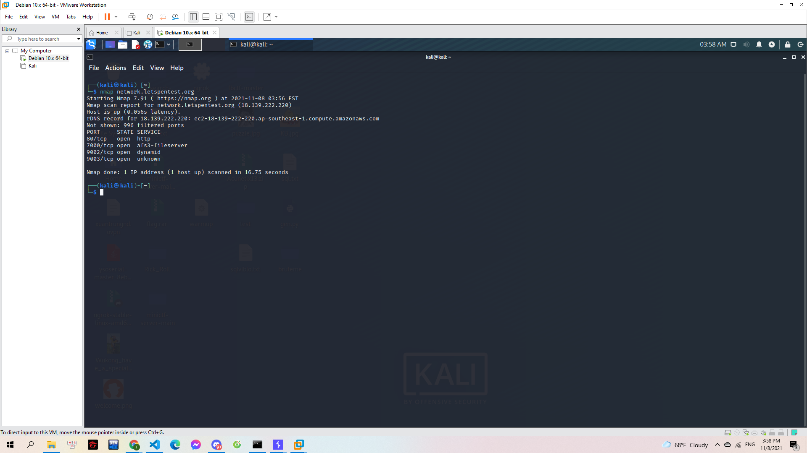
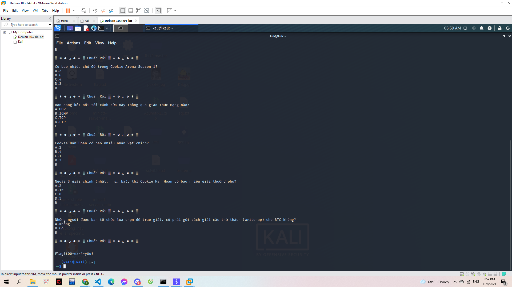

# Very Good Shipper

Hãy tham gia đấu trường Cookie phiên bản nhanh như chớp. Gà phải chọn ra đáp án đúng trong thời gian nhanh nhất.

Giao thức TCP sẽ giúp các câu trả lời của Gà luôn được đảm bảo gửi đến máy chủ của Cookie Arena mà không bị rơi rớt một từ nào.

Tuy nhiên, Gà đã quên cổng kết nối vào máy chủ. Chỉ nhớ mang máng là nó giống với thử thách "Scan me if you can"

> network.letspentest.org

---

Không biết cần kết nối đến port nào nên mình đã sử dụng `nmap` để kiểm tra:

> 

Xác định được có 4 port đang mở. Mình sử dụng `nc` để kết nối tới từng port. Khi kết nối port `9003` thì mình cần tham gia giải 1 vài câu đố. Sau khi hoàn thành thì mình có được flag:

> 

**Flag{t00-ez-4-y0u}**
