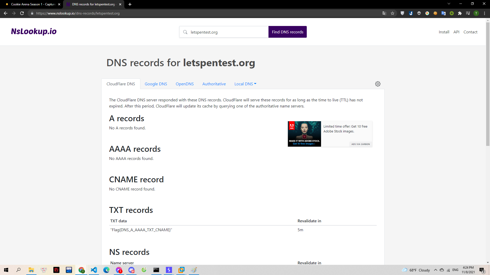

# DNS CHÍNH LÀ XƯƠNG SỐNG CỦA INTERNET.

Tên miền hay Domain chính là địa chỉ trang web, thứ mà các bạn vẫn hay gõ vào trên thanh địa chỉ trên trình duyệt để đọc báo hay lướt web, xem phim.

Trên Internet mọi máy tính, máy chủ, các thiết bị mạng được kết nối và giao tiếp với nhau thông qua hệ thống cáp mạng chằng chịt và khổng lồ. Các máy tính sẽ được gán cho nhau những dãy số để định danh với nhau gọi là địa chỉ IP. Nói một cách dễ hiểu thì một ai đó muốn ghé thăm nhà bạn thì họ cần phải có địa chỉ nhà. Những dãy số địa chỉ này có độ dài có thể lên đến 12 hoặc 45 kí tự.

Đến mật khẩu 6 kí tự bạn còn không nhớ nổi, vì thế năm 1984 DNS (Domain Name System) được phát minh để giúp bạn kết nối với nhau bằng tên gọi.

Bạn chỉ cần nhớ `letspentest.org` thay vì những dãy số khô khan và kì quặc. Khi vừa Enter, hệ thống DNS bắt đầu hoạt động, nó như tấm bản đồ để chỉ cho bạn biết "Hey, cái tên miền của Cookie có địa chỉ IP là X.X.X.X, hãy tới đó mà lấy thông tin đê". DNS cũng trả lời cho bạn biết "X.X.X.X có phải địa chỉ nhà Cookie Hân Hoan hay không"

DNS cũng chứa các thông tin khác, nó gọi là các bản ghi (Record). Bạn thử tìm xem domain này còn có những bản ghi nào chứa những điều kì quặc không?

> letspentest.org

---

Xác định được việc cần làm là lấy record của DNS `letspentest.org`. Mình sử dụng trang web sau để lấy record:

> https://www.nslookup.io/

Nhập DNS cần lấy record và mình lấy được flag:

> 

**Flag{DNS_A_AAAA_TXT_CNAME}**
