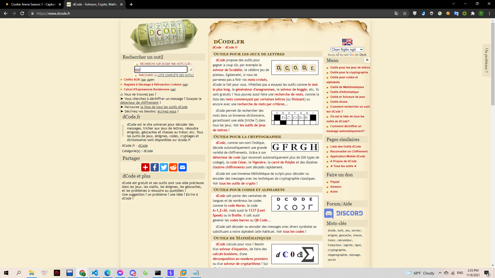
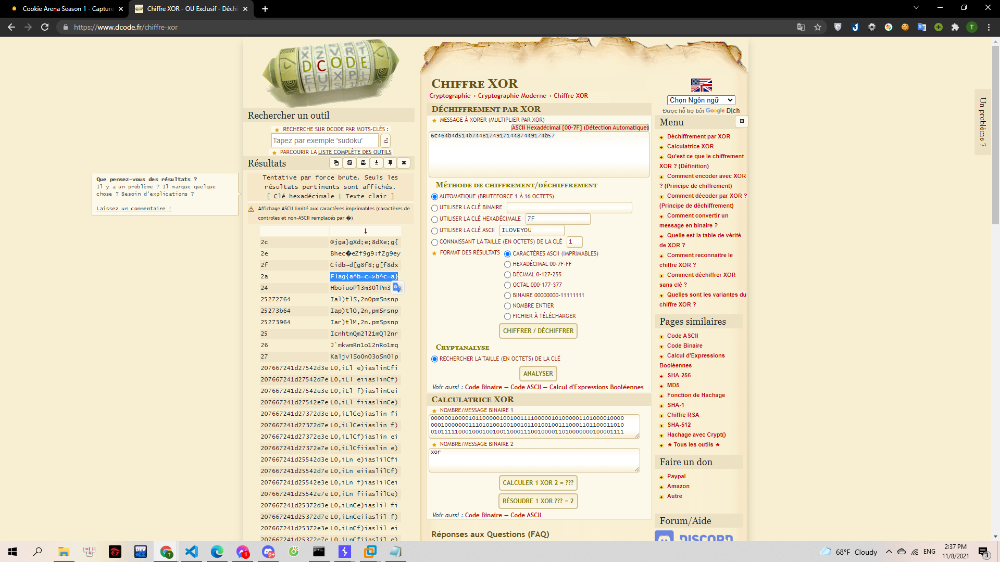

# XOR

> [cipher.txt](cipher.txt)

> [encrypt.py](encrypt.py)

---

Mình tải về 2 file đề

File text là đoạn mã XOR cần decrypt:

> 6c464b4d514b744817491714487449174b57

File py là cách encrypt để mình dựa vào đó giải. Tuy nhiên ở bài này mình dùng một trang dcode.fr có khá đầy đủ các chức năng để giải mã XOR:

> 

Mình tìm và chọn `Chiffre xor`. Sau đó sử dụng tính năng Brute của trang này:

> 

Kết quả hiển thị ở bên trái

**Flag{a^b=c=>b^c=a}**
