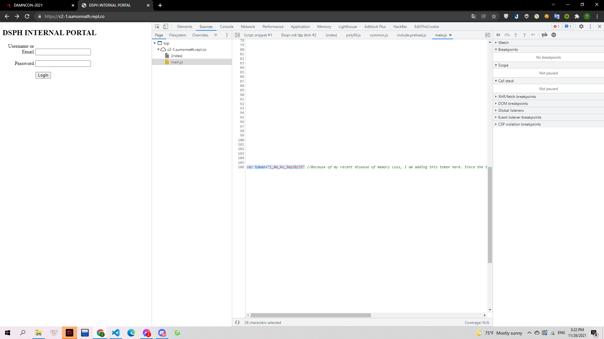

# ADMIN_T3KN_GET

> 

Webchall: https://c2-1.sumonnath.repl.co

---

Khi vừa mới truy cập đường dẫn thì mình nhận được 1 thông báo alert và một form đăng nhập:

> 

Mình check thử source code thì tìm được username và password đăng nhập:

- Username: admin
- Password: p4ssw0rd

> 

Đăng nhập và mình nhận được thông báo rằng mình không phải admin, nên mình đã kiểm tra cookie như những chall trước đó. Và mình nhận thấy được có cặp key-value là `token:0` nên đã tiến hành đi tìm token.

> 

Mình đã thử tương đối nhiều cách với value của token này. Và thấy việc sinh token có vẻ không khả thi nên đã check lại source của trang web. Và khi kiểm tra file main.js hiện thông báo alert khi vừa vào web thì mình đã thấy token:

> 

Token: `1_4m_4n_3mpl0y33`

Sau đó login lại, sửa token rồi reload là mình có được flag.

**Flag: DSPH{y0u_h4ckedd_DspH}**
