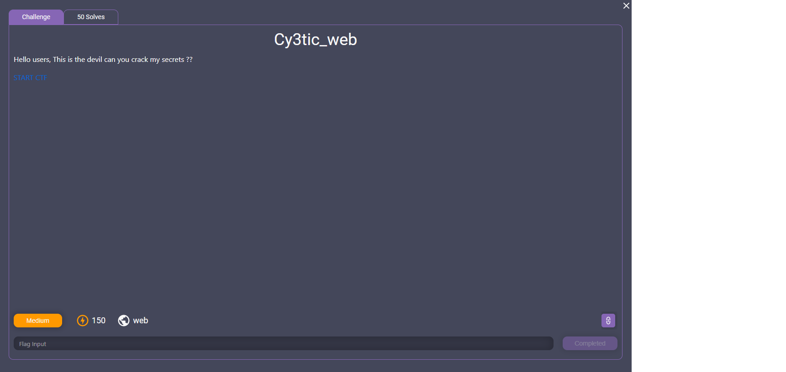
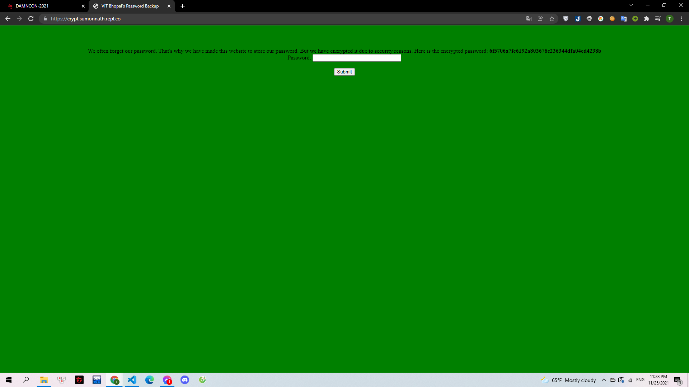
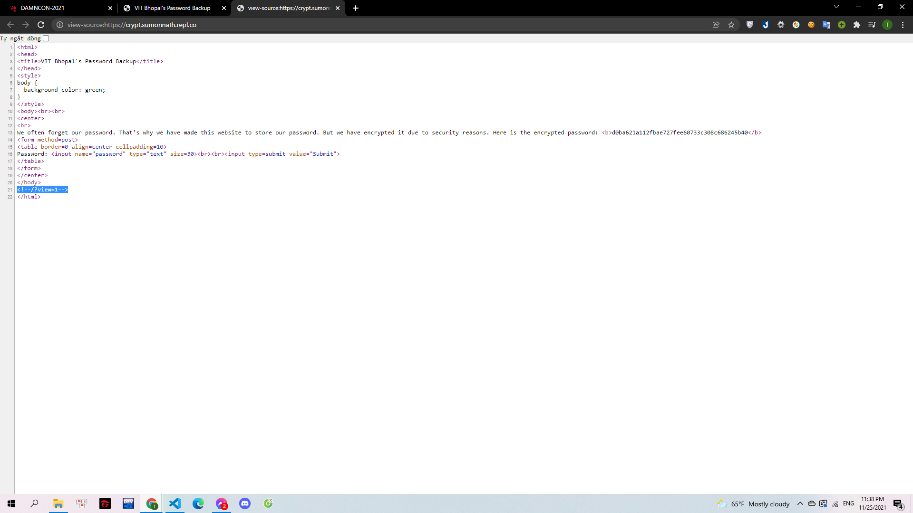
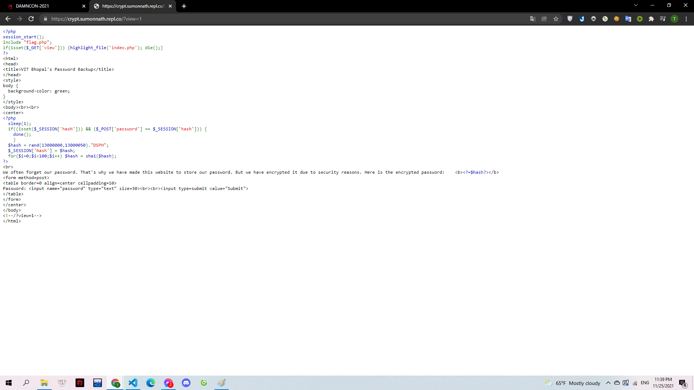
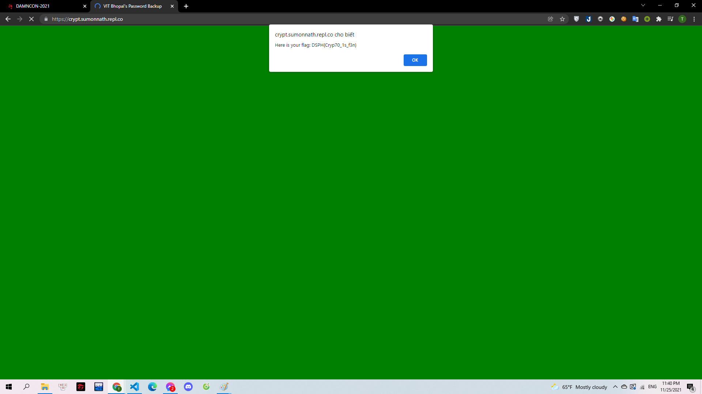

# Cy3tic_web

> 

Webchall: https://crypt.sumonnath.repl.co

---

Bài này cho mình một đoạn mã và một ô password, có lẽ là password sau khi mã hóa sẽ ra được đoạn mã đề cho.

> 

Mình check source tìm xem đoạn mã này được mã hóa như thế nào và tìm được đường dẫn `/?view=1`

> 

Đi theo đường dẫn đó mình tìm được cách mà đoạn mã này được sinh ra:

> 

Có thể thấy rằng đoạn mã được sinh ra từ cách cho random 1 đoạn dạng `130000xxDCPH` trong đó xx từ `00` đến `50`, sau đó băm sha1 100 lần.
Nắm được cách xây dựng của mã nên mình sử dụng python để giải mã.

```python
for i in range (13000000,13000051):
    pass1 = str(i)+"DSPH"
    pass2=pass1.encode('utf8')
    for j in range (0,99):
        pass2=hashlib.sha1(pass2).hexdigest()
        pass2=pass2.encode('utf8')
    pass2=hashlib.sha1(pass2).hexdigest()
    if(pass2=="4620c20b7afb6e71655710f3769b1c9d79b878f7"):
        print(pass1)
```

Phần pass2 để đối chiếu được lấy theo yêu cầu của đề. Và thế là mình có được flag:

> 

**Flag: DSPH{Cryp70_1s_f3n}**
