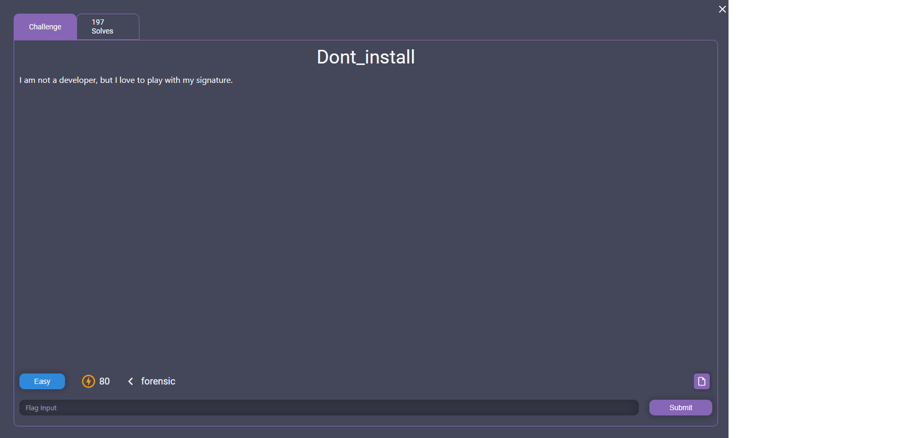
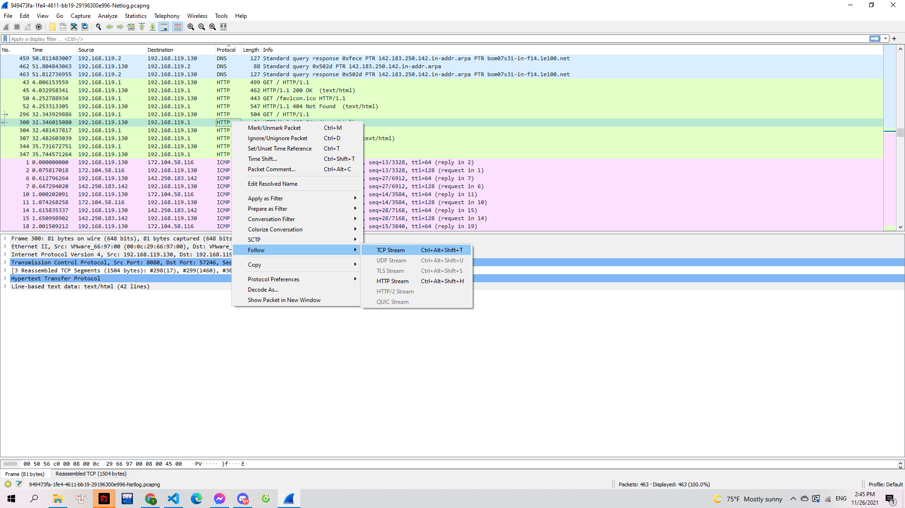
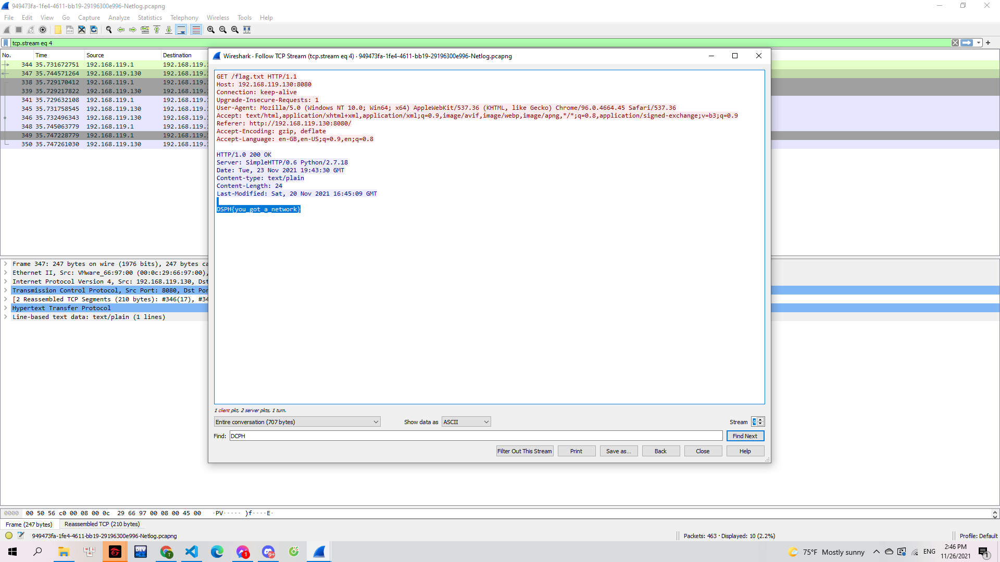

# Dont_install

> 

Tệp đính kèm:

> [949473fa-1fe4-4611-bb19-29196300e996-Netlog.pcapng](949473fa-1fe4-4611-bb19-29196300e996-Netlog.pcapng)

---

Mình mở file này bằng `wireshark` để kiểm tra các gói tin và lựa chọn follow theo luồng TCP:

> 

Sau đó mình tiến hành tìm kiếm cụm từ DCPH thì mình đã thấy ở stream số 4:

> 

**Flag: DSPH{you_got_a_network}**
