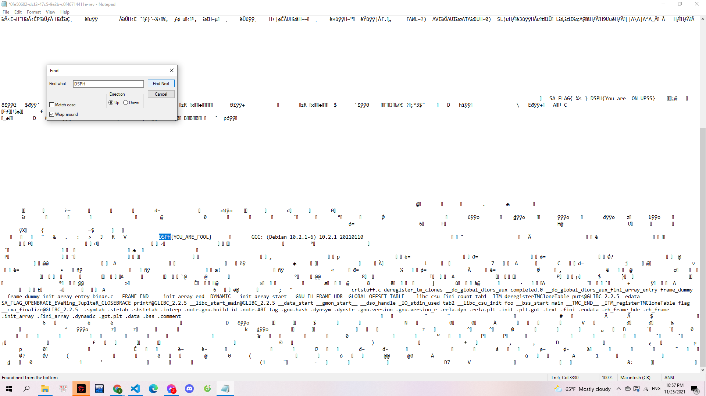

# Easy_but_not_blood

> 

Tệp đính kèm:

> [0fe50602-dcf2-47c5-9e2b-c0f46714411e-rev](0fe50602-dcf2-47c5-9e2b-c0f46714411e-rev)

---

Mình mở tệp bài cho bằng notepad, lướt qua một lượt mình thấy có 1 vài đoạn text có dạng Flag form: `DSPH`. Mình `Ctrl+F` để tìm hết những cụm từ này:

> 

Và mình tìm được 2 cụm:

- DSPH{You_are_ON_UPSS}
- DSPH{YOU_ARE_FOOL}

Sub cả 2 và mình tìm được flag.

**Flag: DSPH{YOU_ARE_FOOL}**
