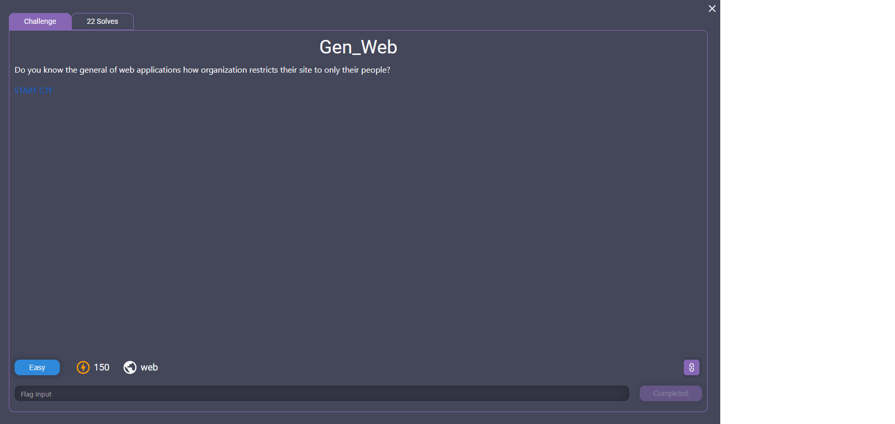
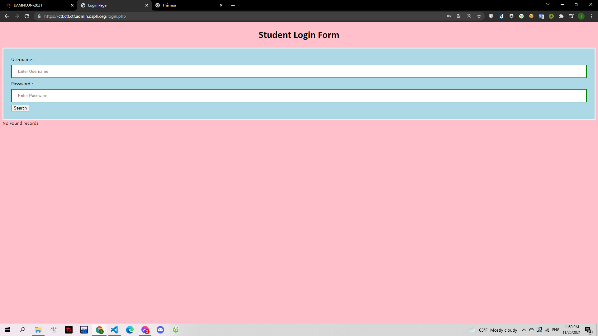
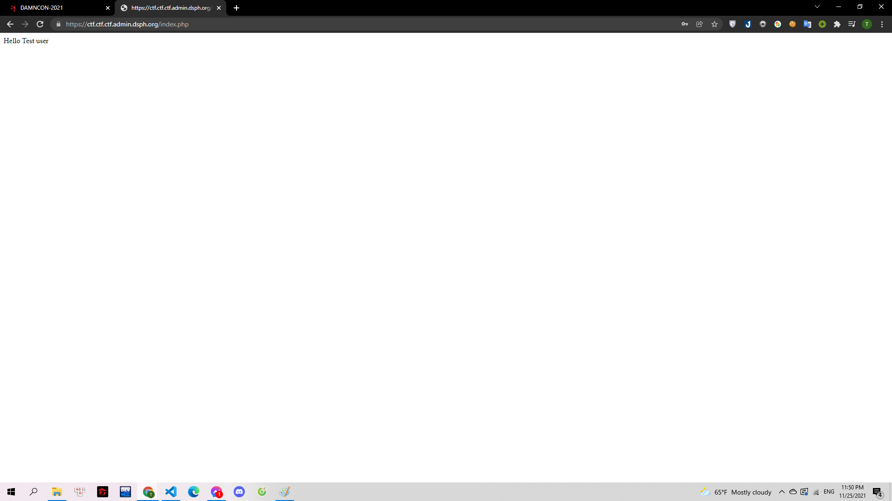
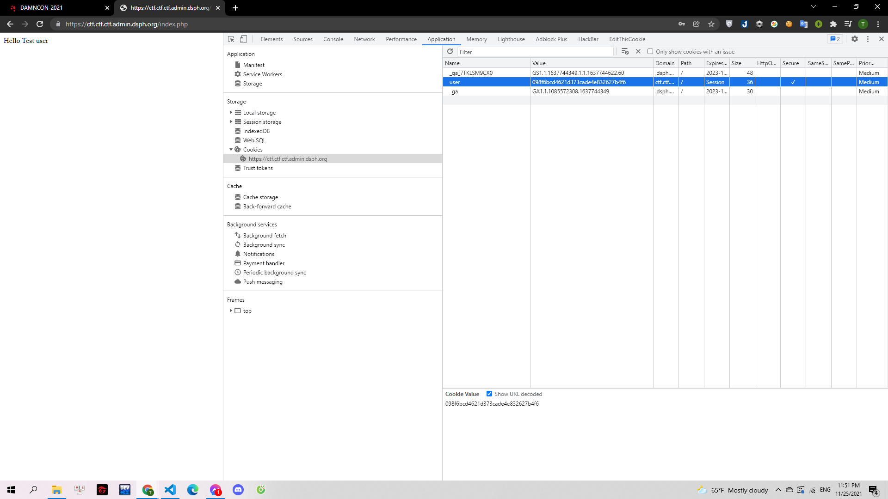
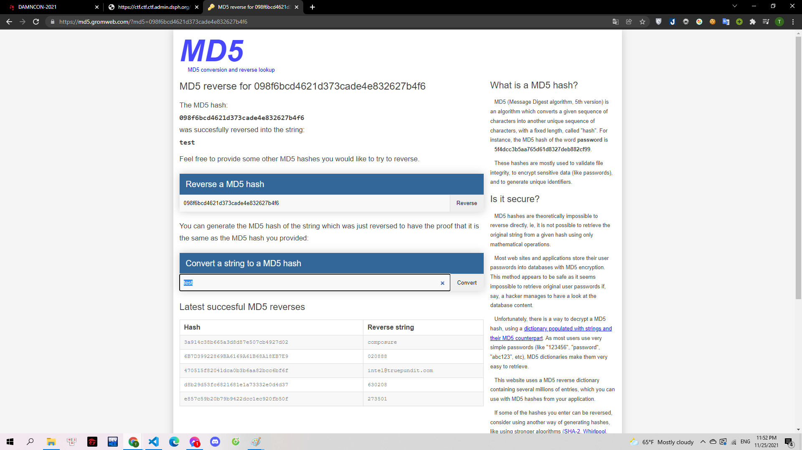
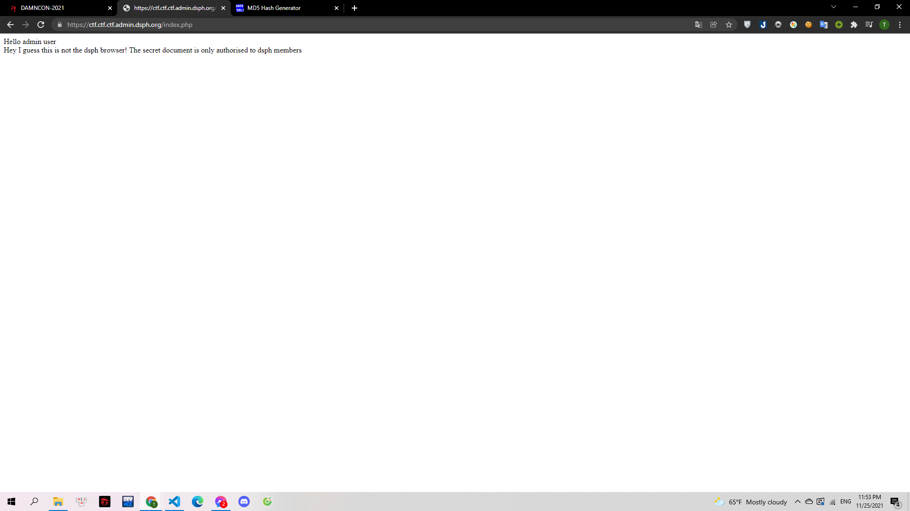
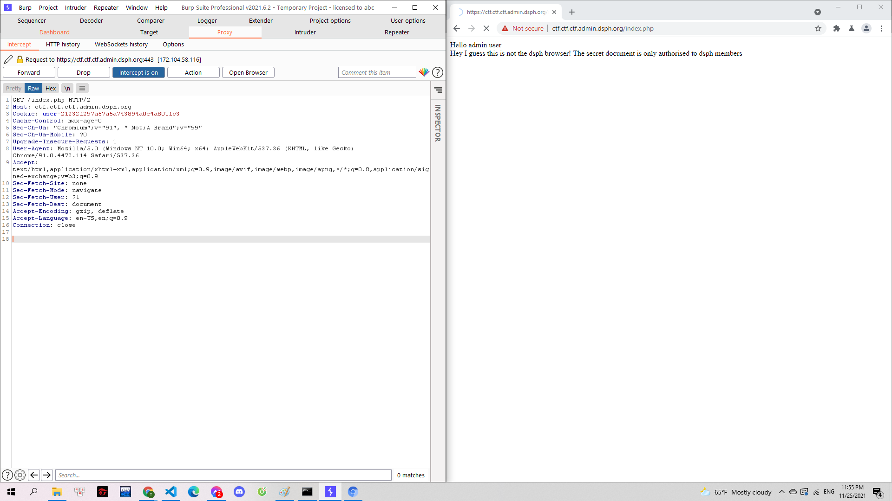

# Gen_Web

> 

Webchall: https://ctf.ctf.ctf.admin.dsph.org/

---

Challenge cho mình một form tìm kiếm, mình thử tìm 1 user bất kì, được kết quả trả về là không tìm thấy:

> 

Sau đó minh test thử SQLi command, user mình để `a' OR 1 = 1#`password bất kì thì đã có thể truy cập được:

> 

Mình thấy trang web xác định mình là test user, mình tiến hành kiểm tra tiếp cookie, thì thấy key để xác định người dùng:

> 

Mình paste value của `User` lên gg thì đã có ngay kết quả
`098f6bcd4621d373cade4e832627b4f6` chính là mã md5 của `test`

> 

Mình mới thử thay đổi thành mã md5 của admin. Mình sinh md5 tại trang https://www.md5hashgenerator.com và có được md5 của `admin` là `21232f297a57a5a743894a0e4a801fc3`.
Thay đổi ở cookie và reload thì thực sự đã có thay đổi:

> 

Challenge tiếp tục yêu cầu mình thay đổi user browser. Mình sử dụng `Burp Suite` để thay đổi trường.

> 

Mình sửa `User-Agent: dsph` vì User-Agent sẽ cho server biết request được thực hiện từ browser nào. Sau đó gửi request lên server và mình có được flag.

**Flag: DAMNCON{S3CR3T_VEnom_Fl7g}**
