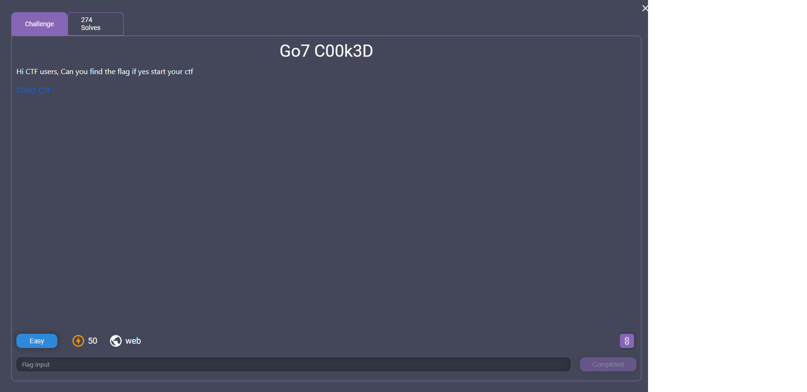
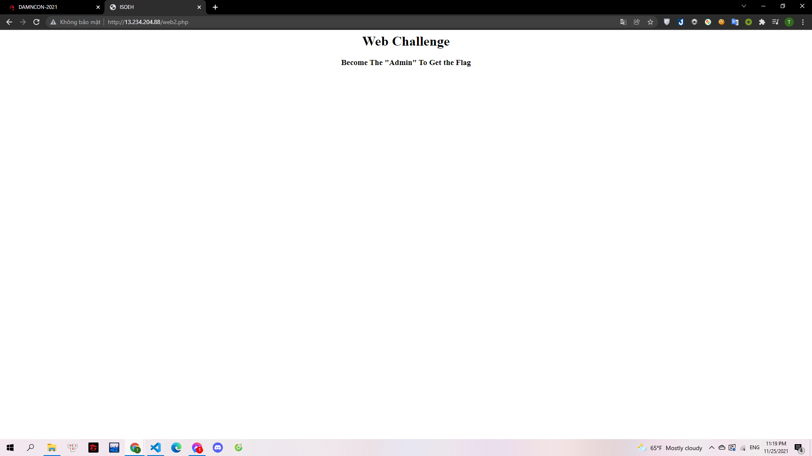
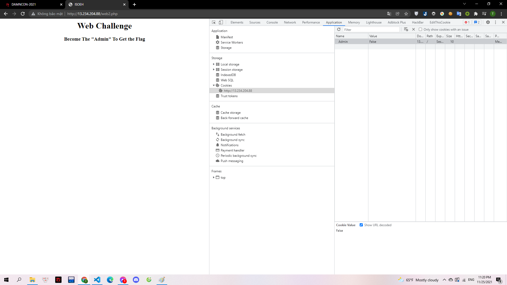
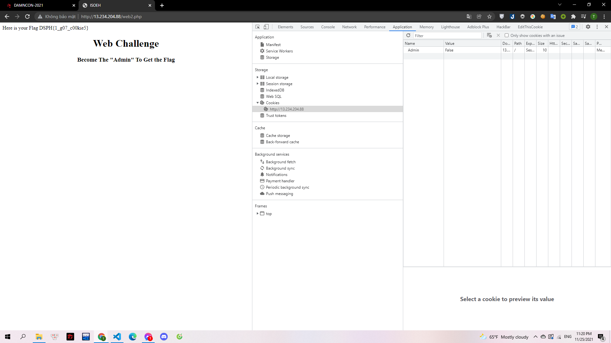

# Go7_C00k3D

> 

Webchall: http://13.234.204.88/web2.php

---

> 

Challenge này yêu cầu chúng ta cần phải trở thành admin để có thể lấy được flag. Có rất nhiều yếu tố quyết định đăng nhập có phải là admin hay không. Và đề bài đã cho mình một hint liên quan đến `cookie` nên mình đã check thử:

> 

Mình đã thấy `cookie` có một key `Admin` có value `False`, mình sửa thành True rồi reload là có được flag:

> 

**DSPH{1_g07_c00kie5}**
