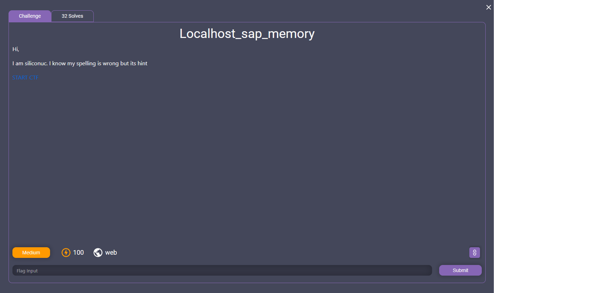
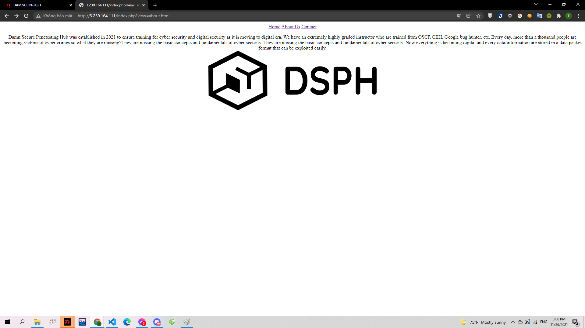
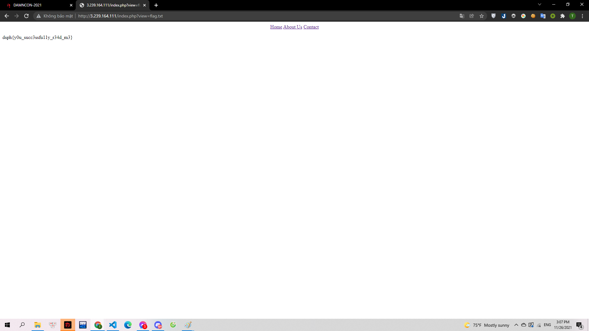

# Localhost_sap_memory

> 

Webchall: http://3.239.164.111

---

Mình truy cập hết vào các đường dẫn có thể của trang web:

> 

Và mình nhận thấy các đường dẫn này đều có dạng `?view=filename`. Và với chall này mình chỉ cần cho filename là `flag.txt` là có thể thấy flag.

> 

**Flag: dsph{y0u_succ3ssfu11y_r34d_m3}**
