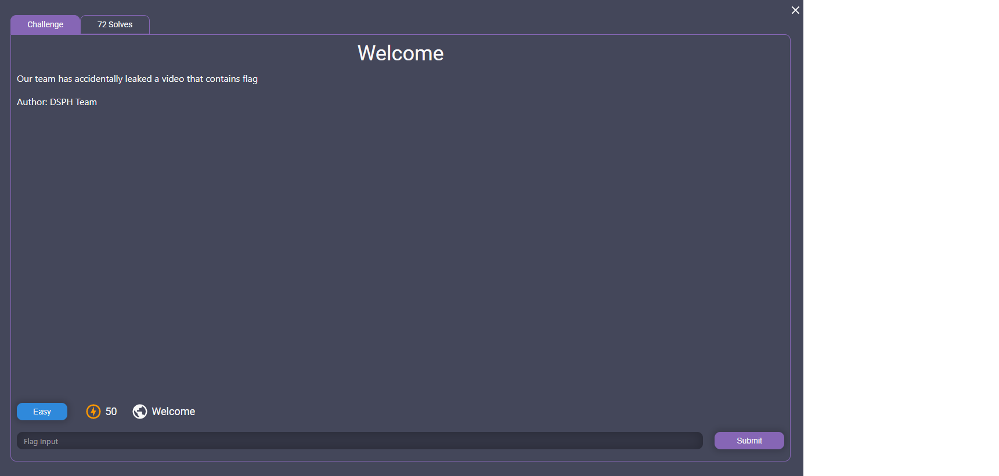
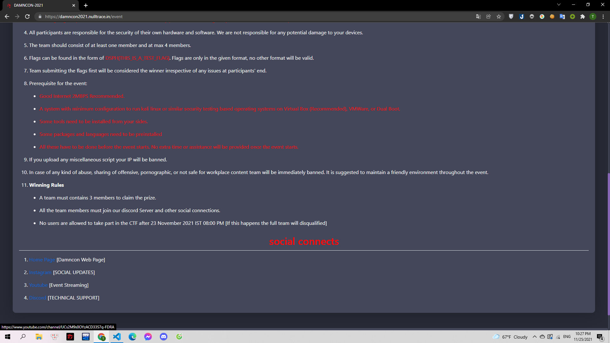
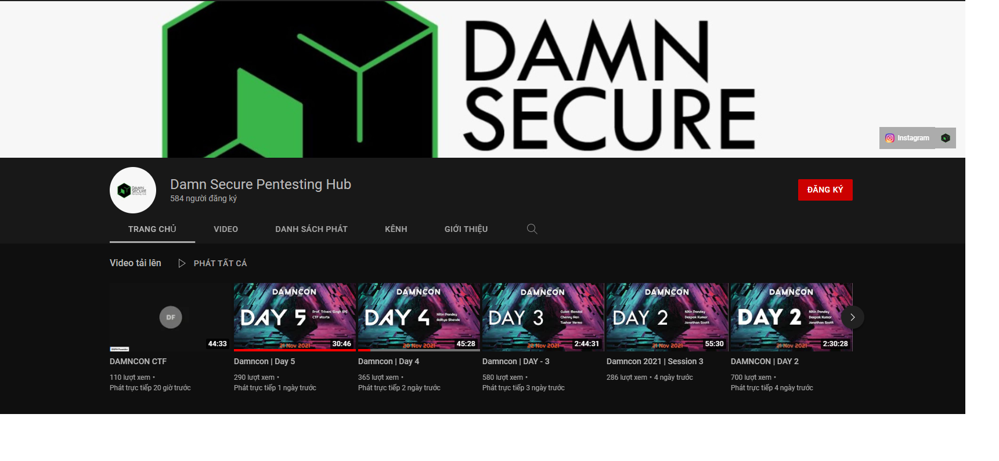
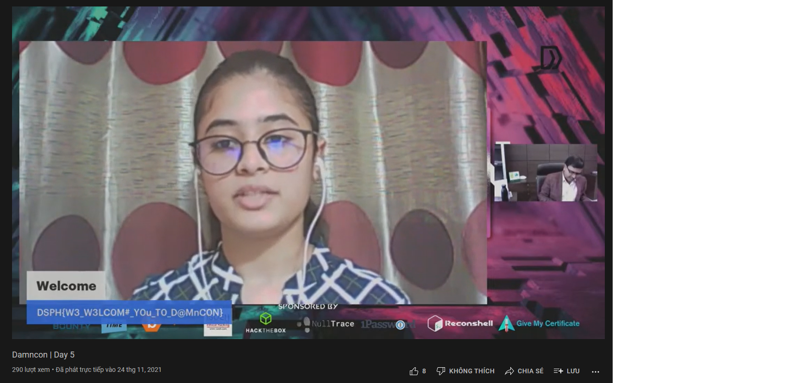

# Welcome

> 

---

Mình theo như mô tả thì mình cần phải tìm ra được video chứa flag. Và mình nghĩ tới kênh youtube của Damncon.
Mình trở lại trang mô tả https://damncon2021.nulltrace.in/event và đã tìm được youtube của giải:

> https://www.youtube.com/channel/UCs2M9s0OYzACD33S7q-FDRA

Mình thấy có 1 vài luồng phát trực tiếp (lúc mình làm thì có 5 video ứng với các ngày).

> 

Mình check từ video mới nhất và tìm được flag ở video day5:

> 

**DSPH{W3_W3LC0M#\_Y0u_T0_D@MnC0N}**
