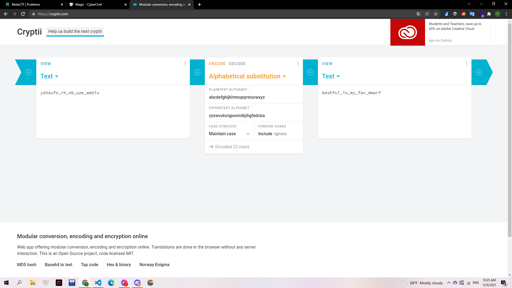

# A to Z

## Mô tả

> This encrypted flag will only require a simple substitution cipher to solve. Rearrange the letters from A to Z. `yzhsufo_rh_nb_uze_wdziu`

---

Theo như mô tả thì challenge này dùng việc đảo chỗ thứ tự các chữ cái. Mình sử dụng trang https://cryptii.com/ và tùy chỉnh như hình dưới để xử lý.

> 

**Flag:bashful_is_my_fav_dwarf**
