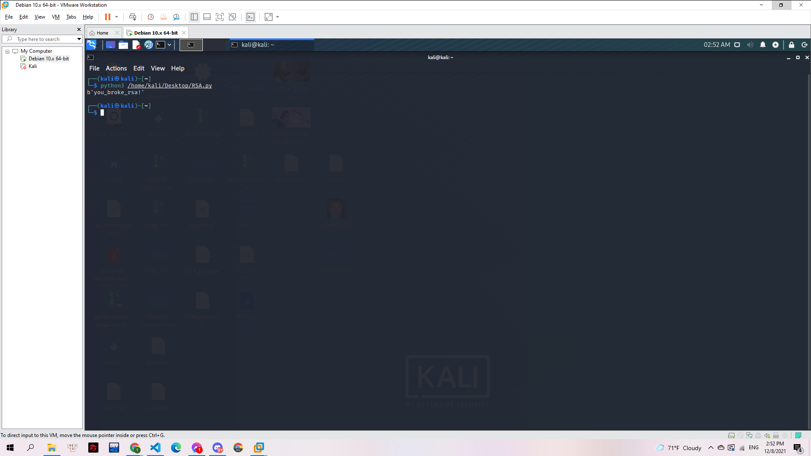

# Size Matters

## Mô tả

> RSA is a public key cryptosystem, where one can encrypt a message with one key and decrypt it with another. We've intercepted a secure message encrypted with RSA, as well as the key used to encrypt it. Since RSA keys have to be pretty big in order to be secure, we're pretty sure you can break this one. Give it a shot!

> `Ciphertext: 0x2526512a4abf23fca755defc497b9ab`

> `e: 257`

> `n: 0x592f144c0aeac50bdf57cf6a6a6e135`

---

Một challenge về RSA. Ciphertext và n được cho dưới dạng mã hex bytes. Mình chuyển về int qua kt.gy:

int of Ciphertext: 3086274334409993602095103985623480747

int of n: 7409108828132483935605377602576376117

Mình tìm 2 số p,q qua http://factordb.com/

n=p\*q= 430535396861370041\*17209058493553260637

Từ đó tìm được phi

phi=(p-1)\*(q-1)

Để tìm public key d và giải mã tiếp thì mình sử dụng đoạn [mã python](RSA.py) sau:

```python
from Crypto.Util.number import long_to_bytes
c=3086274334409993602095103985623480747
n=7409108828132483935605377602576376117
p=430535396861370041
q=17209058493553260637
phi=(q-1)*(p-1)
d=pow(257,-1,phi)
p=pow(c,d,n)
print(long_to_bytes(p))
```

Chạy và mình có kết quả:

> 

**Flag: you_broke_rsa!**
