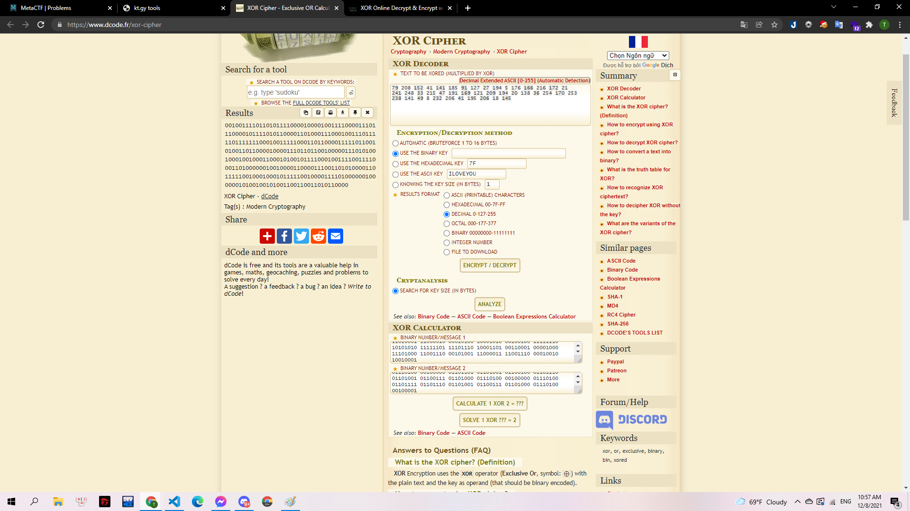

# Unbreakable Encryption

## Mô tả

> There is a form of truly unbreakable encryption: the one time pad. Nobody, not Russia, not China, and not even Steve, who lives in his mom's basement and hacks governments for fun, can decrypt anything using this cipher... as long as it's used correctly. In this scheme, a truly random string as long as the plaintext is chosen, and the ciphertext is computed as the bitwise XOR of the plaintext and the key. However, if the key is reused even once, it can be cracked. We've intercepted some messages between some criminals, and we're hoping you could crack the one time pad they used. We're pretty sure they reused it, so you should be able to crack it...

> `Ciphertext 1: 4fd098298db95b7f1bc205b0a6d8ac15f1f821d72fbfa979d1c2148a24feaafdee8d3108e8ce29c3ce1291`

> `Plaintext 1: hey let's rob the bank at midnight tonight!`

> `Ciphertext 2: 41d9806ec1b55c78258703be87ac9e06edb7369133b1d67ac0960d8632cfb7f2e7974e0ff3c536c1871b`

---

Challenge này sử dụng cách XOR từng byte của ciphertext với key để ra được plaintext. Tuy nhiên phần key đã bị ẩn đi.

Mình chuyển đổi ciphertext1 và plaintext1 sang binary và sử dụng https://www.dcode.fr/chiffre-xor để tìm key.

> c1_bi:01001111 11010000 10011000 00101001 10001101 10111001 01011011 01111111 00011011 11000010 00000101 10110000 10100110 11011000 10101100 00010101 11110001 11111000 00100001 11010111 00101111 10111111 10101001 01111001 11010001 11000010 00010100 10001010 00100100 11111110 10101010 11111101 11101110 10001101 00110001 00001000 11101000 11001110 00101001 11000011 11001110 00010010 10010001

> p1_bi: 01101000 01100101 01111001 00100000 01101100 01100101 01110100 00100111 01110011 00100000 01110010 01101111 01100010 00100000 01110100 01101000 01100101 00100000 01100010 01100001 01101110 01101011 00100000 01100001 01110100 00100000 01101101 01101001 01100100 01101110 01101001 01100111 01101000 01110100 00100000 01110100 01101111 01101110 01101001 01100111 01101000 01110100 00100001

Mình tìm được key:

key: 00100111101101011110000100001001111000011101110000101111010110000110100011100010011101111101111111000100111110001101100001111101100101001101100001000011101101100100000111010100100010010001100010100101111000100111100111100011010000001001000011000011100110101000011011111001000100010111110010000111101000000100000010100100101001100110011010110000

> 

Mình tiếp tục tìm ciphertext dạng binary và từ đó xor với key để ra plaintext dạng binary:

> c2_bi: 01000001 11011001 10000000 01101110 11000001 10110101 01011100 01111000 00100101 10000111 00000011 10111110 10000111 10101100 10011110 00000110 11101101 10110111 00110110 10010001 00110011 10110001 11010110 01111010 11000000 10010110 00001101 10000110 00110010 11001111 10110111 11110010 11100111 10010111 01001110 00001111 11110011 11000101 00110110 11000001 10000111 00011011

> p2_bi: 011001100110110001100001011001110010000001101001011100110010000001001101011001010111010001100001010000110101010001000110011110110111100101101111011101010010011101110010011001010101111101100010011001010111010001110100011001010111001001011111011101000110100001100001011011100101111101110011011101000110010101110110011001010010000101111101

Sử dụng kt.gy để chuyển về dạng string là có được flag.
Ngoài ra sau khi kết thúc giải mình có ngồi và viết 1 đoạn [code python](encrypt.py) để giải challenge này:

```python
c1='4fd098298db95b7f1bc205b0a6d8ac15f1f821d72fbfa979d1c2148a24feaafdee8d3108e8ce29c3ce1291'
p1="hey let's rob the bank at midnight tonight!"
c2='41d9806ec1b55c78258703be87ac9e06edb7369133b1d67ac0960d8632cfb7f2e7974e0ff3c536c1871b'
c1_dec=[i for i in bytes.fromhex(c1)]
p1_dec=[ord(i) for i in p1]
key_dec=[c1_dec[i]^p1_dec[i] for i in range(0,len(p1_dec))]
c2_dec=[i for i in bytes.fromhex(c2)]
p2_dec=[c2_dec[i]^key_dec[i] for i in range(0,len(c2_dec))]
for i in p2_dec:
    print(chr(i),end='')

```

**Flag: MetaCTF{you're_better_than_steve!}**
