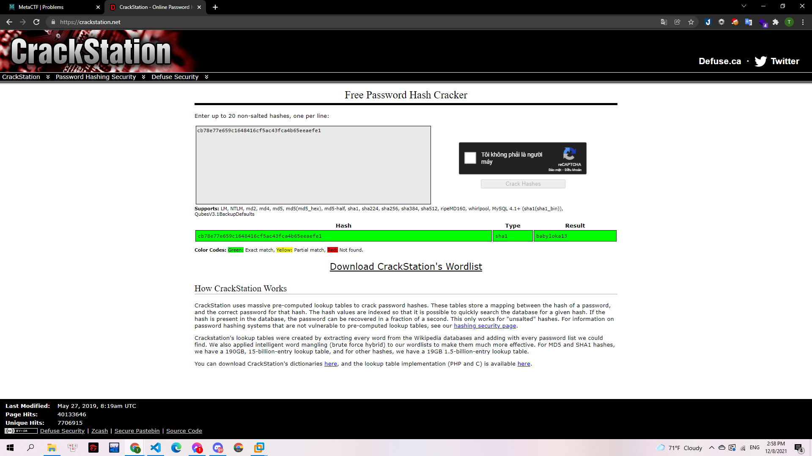

# Wrong Way on a One Way Street

## Mô tả

> Hashing is a system by which information is encrypted such that it can never be decrypted... theoretically. Websites will often hash passwords so that if their passwords are ever leaked, bad actors won't actually learn the user's password; they'll just get an encrypted form of it. However, the same password will always hash to the same ciphertext, so if the attacker can guess your password, they can figure out the hash. Can you guess the password for this hash? `cb78e77e659c1648416cf5ac43fca4b65eeaefe1`

---

Để giải được các hàm băm là điều rất khó. Tuy nhiên hiện nay có khá nhiều trang web đã lưu các hàm băm phổ thông. Mình chỉ có cách dựa theo các trang web đó để tìm. Và mình sử dụng trang https://crackstation.net/

> 

Rất may mắn là hàm băm này đã được lưu và mình có được flag:

**Flag: babyloka13**
