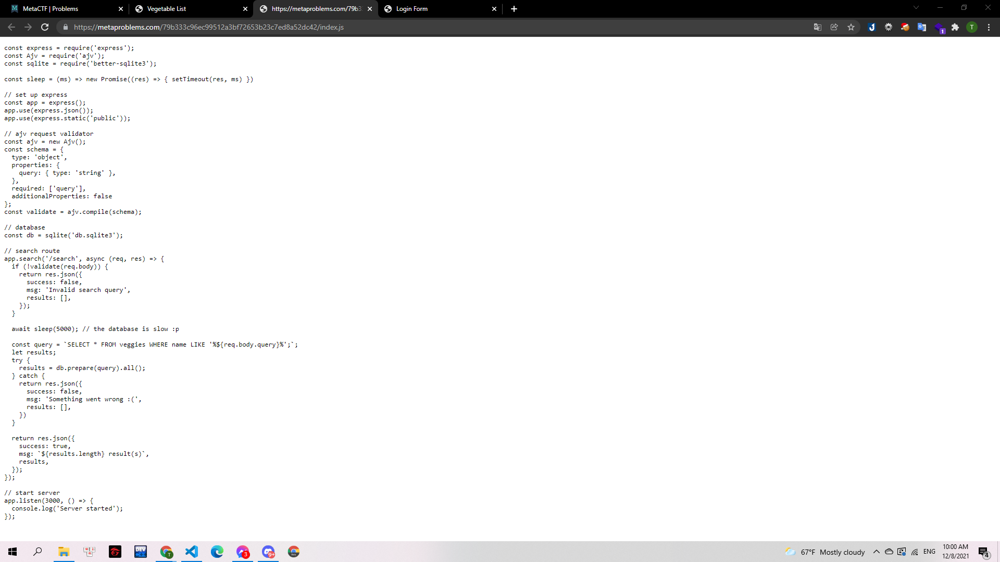

# Yummy Vegetables

## Mô tả

> I love me my vegetables, but I can never remember what color they are! I know lots of people have this problem, so [I made a site to help.](http://host.cg21.metaproblems.com:4010/)

> Here's some sauce to go with the vegetables: [index.js](https://metaproblems.com/79b333c96ec99512a3bf72653b23c7ed8a52dc42/index.js)

---

Mình được cung cấp 1 trang web tìm kiếm và 1 trang source code js:

>  >

Mình thấy phần source code js có sử dụng đến database và mình đã test thử với lỗi SQL injection: `1' OR 1=1--`

> 

Đúng như mình dự đoán, trang web bị lỗi SQLi, mình tiếp tục tìm số cột của database bằng truy vấn `ORDER BY 3--`. Khi x tăng lên 4 thì truy vấn lỗi => database có 3 cột :

> 

Nhưng nhận thấy chỉ có 2 cột được hiển thị nên mình tìm các cột hiển thị ra màn hình: `a' UNION SELECT 'a','b','c'--`

> 

Sau đó mình mới đi kiểm tra xem loại database được sử dụng là gì. Mình test bằng cách SELECT version, mình chọn được payload: `a' UNION SELECT 'a',sqlite_version(),'c'--`, từ đó xác định được database được sử dụng là SQLite:

> 

Mình sẽ sử dụng cú pháp của SQLite để tiếp tục lấy data. Mình lấy data trong cơ sở dữ liệu với payload: `a' UNION SELECT 'a','b',sql FROM sqlite_schema--`

> 

Mình lấy được data gồm các column và cả các tables. Mình thấy có 1 table có liên quan tới flag. Nên đã quyết định truy cập vào đó:
`a' UNION SELECT 'a','b',flag FROM the_flag_is_in_here_730387f4b640c398a3d769a39f9cf9b5--`
Và mình đã lấy được flag:

> 

**Flag:MetaCTF{sql1t3_m4st3r_0r_just_gu3ss_g0d??}**
